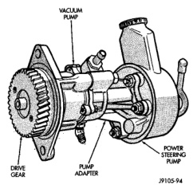

# 25-29 EMISSION CONTROL SYSTEMS — BR

## DESCRIPTION AND OPERATION (Continued)

*Fig. 5 Engine Vacuum Pump]*

140°F but less than 220°F, and intake manifold air temperature is more than 20°F but less than 170°F.

- A ground signal from the PCM is supplied to the EGR solenoid.

- Vacuum passes through the EGR solenoid to the EGR valve diaphragm.

- The inlet seat (poppet valve) at the bottom of the EGR valve opens to dilute and recirculate exhaust gas back into the intake manifold.

The EGR system will be activated at engine idle speed. This is if PCM operating parameters for EGR system operation have been met.

The EGR system will be shut down briefly if the PCM has determined that a rapid acceleration is occurring. This is determined by a change in TPS voltage (mechanical throttle movement). The PCM will leave the EGR system shut down for a few additional seconds after the throttle has been depressed.

The EGR system will also be shut down for wide open throttle (WOT) conditions.

The EGR system will also be shut down by the PCM if the PCM has not sensed a TPS voltage change (mechanical throttle movement) after 2 continuous minutes. This shut down may occur at either engine idle speed or normal cruising speeds.

Each time the engine is operated, an on-board diagnostic test will be run to verify EGR system operation. Certain failures will illuminate the MIL (Malfunction Indicator Lamp). The MIL is indicated on the instrument panel as the Check Engine Lamp. Refer to the On-Board Diagnostic section for additional information. Also refer to the appropriate Powertrain Diagnostic Procedures service manual.

## DIAGNOSIS AND TESTING

### EGR SYSTEM TEST

EGR system operation must first be checked with the DRB scan tool. To perform a test of the EGR system, refer to the appropriate Powertrain Diagnostic Procedures service manual. Check and correct any electrical malfunctions before proceeding.

Do not attempt to diagnose a defective EGR valve by applying vacuum to the EGR valve diaphragm fitting with engine running. Opening the EGR valve at idle speed will not change idle speed.

(1) Check operation of EGR valve vacuum regulator solenoid and EGR system with DRB scan tool.

(2) Start engine and verify that vacuum is available at inlet fitting of EGR valve vacuum regulator solenoid. Vacuum is supplied by an engine driven vacuum pump (Fig. 5). Refer to Group 9, Engines for vacuum pump specifications and test procedures.

(3) Check EGR valve for operation and leaks. Refer to EGR Valve Test.

(4) Check operation of one-way check valve (Fig. 1). Refer to Check Valve Test.

---
*Source: Chapter 25 Emission Control Systems, Page 29*
