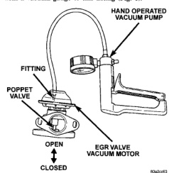

# 25-30 EMISSION CONTROL SYSTEMS — BR

## DIAGNOSIS AND TESTING (Continued)

### EGR VALVE TEST

Use the following test procedure to determine if exhaust gas is flowing through the EGR valve. It can also be used to determine if the EGR tube is plugged, or the system passages in the intake or exhaust manifolds are plugged.

This is not to be used as a complete test of the EGR system.

(1) To verify EGR valve operation, it must be removed from intake manifold. Refer to EGR Valve Removal/Installation procedures.

(2) Examine the head of poppet valve at base opening on bottom of EGR valve. Look for heavy carbon build-up. A coating of carbon is normal with engine operation. Shine a bright light through valve opening and examine edge (seat) of poppet valve. No light should be evident at valve edge. If either condition exists, replace EGR valve. Do not attempt to clean the poppet valve within the EGR valve assembly.

(3) The EGR valve is equipped with a fitting located on the EGR valve vacuum motor (Fig. 6).

(4) Connect a hand-held vacuum pump equipped with a vacuum gauge to this fitting (Fig. 6).

*Fig. 6 Vacuum Pump at EGR Valve]*

(5) Slowly apply 10 inches Hg of vacuum to the fitting on the EGR valve motor. The poppet valve (Fig. 6) should start to open at approximately 10 inches of vacuum. Vacuum should hold steady at 10 inches. If not, replace the EGR valve. If vacuum holds steady at 10 inches, and poppet valve has started to open, proceed to next step.

(6) Continue to apply vacuum until gauge reading is at 20 inches. The poppet valve should be fully open at approximately 20 inches of vacuum. Vacuum should also hold steady at 20 inches. If not, replace the EGR valve.

(7) If the EGR valve tested OK, the EGR tube may be plugged with carbon, or the passages in the intake and exhaust manifolds may be plugged with carbon.

(8) While the EGR valve is removed, check passages in EGR tube. Remove the EGR tube between the intake and exhaust manifolds. Check and clean the EGR tube and its related openings on the manifolds. Refer to EGR Tube Removal/Installation in this group for procedures.

(9) While the EGR valve is removed, check for carbon build-up at intake manifold openings. Clean carbon deposits as necessary.

Do not attempt to clean the poppet valve within the EGR valve assembly. If the valve shows evidence of heavy carbon build-up near the base or around poppet valve, replace it.

### EGR VALVE VACUUM REGULATOR SOLENOID TEST

To perform an electrical test of this solenoid, refer to the DRB scan tool. Also refer to the appropriate Powertrain Diagnostic Procedures manual. Vacuum to the solenoid is supplied from an engine driven vacuum pump (Fig. 5). Refer to Group 9, Engines for vacuum pump specifications and test procedures.

### CHECK VALVE TEST

This is not to be used as a test of the EGR system. Refer to DRB scan tool and appropriate Powertrain Diagnostic Procedures service manual.

A quick-release type, one-way check valve is located in the vacuum line between the EGR valve and the EGR valve vacuum regulator solenoid (Fig. 1). This check valve allows engine vacuum to be quickly bled from EGR valve. If the valve is defective, vacuum will be stored in the EGR valve diaphragm motor (EGR valve will remain open). If the valve is leaking, the EGR valve may not open.

(1) Attach a vacuum gauge with a "T" fitting into the vacuum line at EGR valve (between EGR valve and EGR vacuum regulator solenoid).

(2) Bring engine to operating temperature to allow EGR system operation.

(3) While driving at steady speed, high vacuum should be observed at gauge.

(4) Quickly open the throttle while observing gauge.

(5) Gauge should immediately drop to 0 inches. If any vacuum is being stored (gauge reading anything other than 0 inches), test EGR system electrical operation using the DRB scan tool. If EGR system electrical operation is OK, but gauge reading has not

---
*Source: Chapter 25 Emission Control Systems, Page 30*
