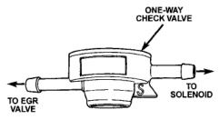
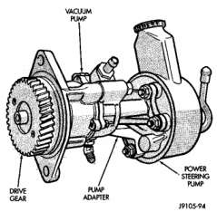
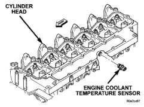

# 25-31 EMISSION CONTROL SYSTEMS — BR

## DIAGNOSIS AND TESTING (Continued)

dropped to 0 inches, proceed to next step before replacing check valve.

(6) Disconnect the vacuum lines at both ends of check valve and remove valve from vehicle.

(7) Attach a hand-operated vacuum pump equipped with a vacuum gauge to the inlet fitting on check valve (to solenoid). The inlet end of fitting is marked with an S (Fig. 7).

*Fig. 7 One-Way Check Valve]*

(8) Apply a minimum of 20 in. vacuum or more to this fitting while plugging opposite fitting with a finger. Vacuum gauge should remain constant at 20 or more inches without any leakage. If not, replace check valve.

(9) Attach vacuum pump to the fitting at EGR valve end of check valve.

(10) Apply vacuum to this fitting while plugging opposite fitting with a finger. While operating vacuum pump, vacuum gauge should remain at or near 0 inches. If any vacuum is being stored, replace check valve.

### VACUUM SUPPLY TEST

Vacuum for the EGR valve and EGR solenoid is provided by a vacuum pump. This pump is mounted to the gear housing at front of engine and attached to power steering pump (Fig. 8).

Refer to Group 9, Engines, for additional vacuum pump information and minimum/maximum vacuum specifications.

(1) Disconnect the vacuum supply line at EGR valve vacuum regulator solenoid.

(2) Attach a vacuum gauge at this point.

(3) Start the engine.

(4) If vacuum will not meet specifications as shown in Group 9, Engines, check for leaks in vacuum lines between solenoid and vacuum pump before condemning vacuum pump.

*Fig. 8 Vacuum Pump]*

### ENGINE COOLANT TEMPERATURE SENSOR—DIESEL ENGINE

To perform a complete test of the Engine Coolant Temperature (ECT) sensor and its circuitry, refer to DRB scan tool and appropriate Powertrain Diagnostics Procedures manual. To test the sensor only, refer to the following:

The ECT sensor is located on the left side of cylinder head behind fuel filter and below the intake manifold (Fig. 9).

(1) The ECT sensor is equipped with a 9 inch long jumper harness. This harness connects the ECT sensor to the main engine wiring harness. The end of the harness is located near the top of the fuel filter. It is used for sensor tests. Disconnect jumper harness connector from main engine wiring harness.

*Fig. 9 ECT Sensor—Diesel Engine]*

---
*Source: Chapter 25 Emission Control Systems, Page 31*
