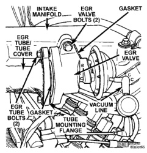

# 25-32 EMISSION CONTROL SYSTEMS — BR

## DIAGNOSIS AND TESTING (Continued)

(2) Test resistance of sensor with a high input impedance (digital) volt-ohmmeter. The resistance (as measured across the jumper harness terminals) should be as shown in ECT SENSOR RESISTANCE (OHMS) chart. Replace sensor if it is not within range of resistance specified in chart.

### ECT SENSOR RESISTANCE (OHMS)

| Temperature (°C) | Temperature (°F) | Resistance Min. (Ohms) | Resistance Max. (Ohms) |
|------------------|------------------|------------------------|------------------------|
| -40 | -40 | 291,490 | 381,710 |
| -20 | -4 | 85,850 | 108,390 |
| -10 | 14 | 49,250 | 61,430 |
| 0 | 32 | 29,330 | 35,990 |
| 10 | 50 | 17,990 | 21,810 |
| 20 | 68 | 11,370 | 13,610 |
| 25 | 77 | 9,120 | 10,880 |
| 30 | 86 | 7,370 | 8,750 |
| 40 | 104 | 4,900 | 5,750 |
| 50 | 122 | 3,330 | 3,880 |
| 60 | 140 | 2,310 | 2,670 |
| 70 | 158 | 1,630 | 1,870 |
| 80 | 176 | 1,170 | 1,340 |
| 90 | 194 | 860 | 970 |
| 100 | 212 | 640 | 720 |
| 110 | 230 | 480 | 540 |
| 120 | 248 | 370 | 410 |

(3) Test continuity of the wire harness between the PCM wire harness connector and the ECT sensor connector terminals. Refer to Group 8, Wiring for terminal/cavity locations. Repair the wire harness if an open circuit is indicated.

(4) After tests are completed, connect jumper harness.

## REMOVAL AND INSTALLATION

### EGR VALVE

#### REMOVAL

(1) Disconnect vacuum line at EGR valve vacuum supply fitting (Fig. 10).

(2) Remove the two bolts retaining EGR tube to side of EGR valve (Fig. 10).

(3) Remove the two EGR valve mounting bolts (Fig. 10) and remove EGR valve.

(4) Discard both of the old EGR mounting gaskets.

#### INSTALLATION

(1) Clean the intake manifold and EGR valve of any old gasket material.

(2) Clean the end of EGR tube of any old gasket material.

*Fig. 10 EGR Valve Removal/Installation]*

(3) Position new gasket between EGR valve and EGR tube and position EGR valve to tube. Install 2 bolts finger tight only.

(4) Position new gasket between EGR valve and intake manifold.

(5) Install 2 EGR valve-to-intake manifold bolts finger tight only.

(6) A slotted mounting bolt hole is located at lower ear on EGR valve. Rotate EGR valve until square to EGR tube. Tighten 2 EGR valve-to-intake manifold bolts to 24 N·m (212 in. lbs.).

(7) Tighten 2 EGR tube-to-EGR valve mounting bolts to 24 N·m (212 in. lbs.). When tightening these 2 bolts, alternate between the upper and lower bolt to allow face of EGR valve to remain square to tube mounting flange (Fig. 10) on EGR tube.

(8) Connect vacuum line to EGR valve.

### EGR TUBE

The EGR tube connects the EGR valve to the rear of the exhaust manifold (Fig. 10).

#### REMOVAL

(1) Remove 2 EGR tube mounting bolts at EGR valve end of tube (Fig. 10).

(2) Remove 2 EGR tube mounting nuts at exhaust manifold end of tube (Fig. 11).

(3) Remove EGR tube and discard old gaskets.

(4) Clean gasket mating surfaces and EGR tube flange gasket surfaces.

---
*Source: Chapter 25 Emission Control Systems, Page 32*
