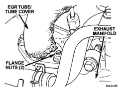
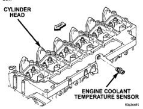
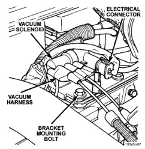

# 25-33 EMISSION CONTROL SYSTEMS — BR

## REMOVAL AND INSTALLATION (Continued)

*Fig. 11 EGR Tube Nuts at Exhaust Manifold]*

(5) Check for signs of leakage or cracked surfaces at both ends of tube, exhaust manifold and EGR valve.

#### INSTALLATION

(1) Install a new gasket to EGR valve end of EGR tube.

(2) Install a new gasket to manifold end of EGR tube.

(3) Position EGR tube to engine and install bolts/nuts.

(4) Tighten all bolts/nuts to 24 N·m (212 in. lbs.) torque. When tightening bolts at EGR valve end of tube, alternate between the upper and lower bolt to allow face of EGR valve to remain square to tube mounting flange (Fig. 10) on EGR tube.

### EGR VALVE VACUUM REGULATOR SOLENOID

The solenoid is located at the top/front of cylinder head (Fig. 12).

#### REMOVAL/INSTALLATION

(1) Disconnect electrical connector at solenoid.

(2) Disconnect vacuum harness at solenoid.

(3) Remove solenoid bracket bolt (Fig. 12).

(4) Remove solenoid and bracket from engine.

(5) Reverse the removal steps for installation. Tighten mounting bolt to 24 N·m (212 in. lbs.) torque.

*Fig. 12 EGR Valve Vacuum Regulator Solenoid]*

### THROTTLE POSITION SENSOR

For removal, installation, testing and adjustment of the throttle position sensor (TPS), refer to the diesel sections of Group 14, Fuel System. The TPS may also be tested with the DRB scan tool. Refer to the appropriate Powertrain Diagnostic Procedures service manual.

### ENGINE COOLANT TEMPERATURE SENSOR—DIESEL ENGINE

The Engine Coolant Temperature (ECT) sensor is located on the left side of the cylinder head behind the fuel filter and below the intake manifold (Fig. 13).

*Fig. 10 ECT Sensor Location—Diesel Engine]*

---
*Source: Chapter 25 Emission Control Systems, Page 33*
