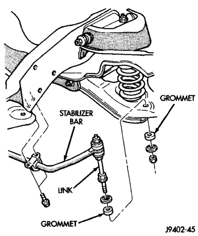

# SUSPENSION 2-10

## REMOVAL AND INSTALLATION (Continued)

   - HD: 149 N·m (110 ft. lbs.)

4. Install cotter pin.

5. Install the brake rotor hub and bearing assembly on spindle. Refer to Wheel Hub and Bearings service installation.

6. Install the brake caliper, refer to Group 5 Brakes.

7. Install wheel and tire assembly.

8. Remove support and lower vehicle.

---

### LOWER SUSPENSION ARM

#### REMOVAL

1. Raise and support vehicle.

2. Follow procedure under Coil Spring Removal.

3. Remove bolts mounting suspension arm to crossmember and remove arm.

#### INSTALLATION

1. Position suspension arm on crossmember and install bolts and nuts snug.

2. Follow procedure under Coil Spring Installation.

3. Remove support and lower vehicle.

4. Tighten suspension arm crossmember nuts to 196 N·m (145 ft. lbs.).

---

### UPPER SUSPENSION ARM

#### REMOVAL

1. Raise and support vehicle.

2. Remove tire and wheel assembly.

3. Support lower suspension arm at outboard end with jack stand.

4. Remove upper ball joint cotter pin and nut.

5. Separate ball joint from knuckle with remover MB-990635.

6. Remove pivot bar bolts from upper suspension arm bracket and remove arm from vehicle (Fig. 5).

*Fig. 5 Upper Suspension Arm*
- Pivot Bar
- Upper Suspension Arm
- Ball Joint

#### INSTALLATION

1. Position upper suspension arm on bracket and install pivot bar bolts. Tighten to 203 N·m (150 ft. lbs.).

2. Install ball joint in knuckle. Install nut and tighten to 81 N·m (60 ft. lbs.) and replacement cotter pin.

3. Remove jack from lower suspension arm.

4. Install tire and wheel assembly.

5. Remove support and lower vehicle.

6. Align front suspension.

---

### STABILIZER BAR

#### REMOVAL

1. Raise and support the vehicle.

2. Disconnect the link from lower suspension arm and stabilizer bar (Fig. 6).

3. Disconnect the stabilizer bar clamps from the frame rails. Remove the stabilizer bar.

*Fig. 6 Stabilizer Bar*

#### INSTALLATION

1. Position the stabilizer bar on the frame rail and install the clamps and bolts. Ensure the bar is centered with equal spacing on both sides. Tighten the bolts to 54 N·m (40 ft. lbs.).

2. Install links on stabilizer bar and lower suspension arm. Install grommets, retainers and nuts. Tighten nuts to 37 N·m (27 ft. lbs.).

3. Remove the supports and lower the vehicle.
