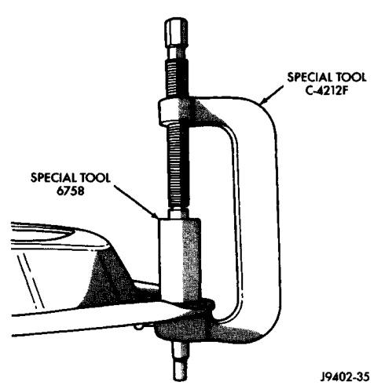
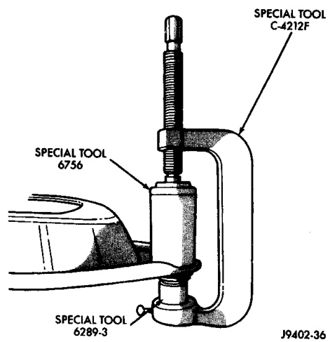
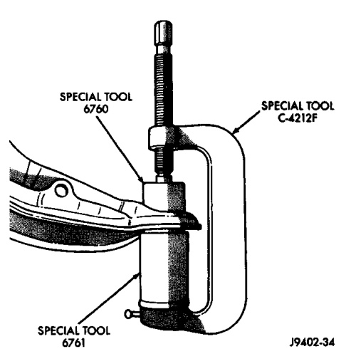

# SUSPENSION 2-12

## DISASSEMBLY AND ASSEMBLY (Continued)

*Fig. 9 Lower Ball Joint Installation*
- Installer 6758
- Receiver 6756

*Fig. 10 Upper Ball Joint Removal*
- Remover 6289-3
- Receiver 6760

*Fig. 8 Upper Ball Joint Installation*
- Installer 6761
- Receiver 6760

---

## CLEANING AND INSPECTION

### WHEEL BEARINGS

> **NOTE:** Bearing and races must be replaced as a set if worn or damaged.

1. Thoroughly clean the interior of hub/rotor.

2. Clean the bearings with solvent and towel dry.

3. After cleaning, apply engine oil to each bearing.

4. Rotate each bearing slowly while applying downward force. Examine the rollers for pitting and roughness, replace bearing if worn or defective.

5. Remove the engine oil from each bearing. Pack each bearing with multi-purpose NLGI, grade 2, EP-type lubricant (or an equivalent lubricant).

> **NOTE:** Ensure that lubricant is forced into all the cavities between the bearing cage and rollers.

---

## SPECIFICATIONS

### TORQUE CHART

| DESCRIPTION | TORQUE |
|-------------|--------|
| **Shock Absorber** | |
| Upper Nut | 47 N·m (35 ft. lbs.) |
| Lower Bolt | 142 N·m (105 ft. lbs.) |
| **Lower Suspension Arm** | |
| Frame Nuts | 197 N·m (145 ft. lbs.) |
| LD Ball Joint Nut | 129 N·m (95 ft. lbs.) |
| HD Ball Joint Nut | 149 N·m (110 ft. lbs.) |
| **Upper Suspension Arm** | |
| Pivot Bar Nuts | 203 N·m (150 ft. lbs.) |
| Ball Joint Nut | 81 N·m (60 ft. lbs.) |
| **Stabilizer Bar** | |
| Clamp Bolt | 54 N·m (40 ft. lbs.) |
| Link Nuts | 37 N·m (27 ft. lbs.) |
