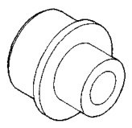

# SUSPENSION 2-13

## SPECIAL TOOLS

### IFS FRONT SUSPENSION

*Fig. 1 Special Tools IFS Front Suspension*

| Tool | Part Number |
|------|-------------|
| Remover, Tie Rod End | MB-990635 |
| Remover, Lower Ball Joint | C-4150A |
| Press Ball Joint Remover/Installer | C-4212F |
| Remover, Ball Joint | 6757 |
| Remover, Ball Joint | 6289-3 |
| Receiver, Ball Joint | 6756 |
| Receiver, Ball Joint | 6760 |
| Installer, Ball Joint | 6758 |
| Installer, Ball Joint | 6761 |
