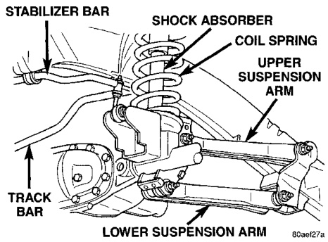

# SUSPENSION 2-14

## FRONT SUSPENSION LINK/COIL

### INDEX

| DESCRIPTION | PAGE |
|-------------|------|
| **DESCRIPTION AND OPERATION** | |
| Front Suspension Link/Coil | 14 |
| **DIAGNOSIS AND TESTING** | |
| Shock Diagnosis | 15 |
| Track Bar | 15 |
| **REMOVAL AND INSTALLATION** | |
| Coil Spring | 16 |
| Hub/Bearing with 5 Studs | 18 |
| Hub/Bearing with 8 Studs | 19 |
| Lower Suspension Arm | 16 |
| Shock Absorber | 15 |
| Stabilizer Bar | 17 |
| Steering Knuckle | 18 |
| Track Bar | 18 |
| Upper Suspension Arm | 16 |
| Wheel Mounting Studs | 21 |
| **SPECIFICATIONS** | |
| Torque Chart | 22 |
| **SPECIAL TOOLS** | |
| Link/Coil Suspension | 22 |

---

## DESCRIPTION AND OPERATION

### FRONT SUSPENSION LINK/COIL

The Ram Truck Link/coil suspension allows each wheel to adapt to different road surfaces. The suspension is comprised of (Fig. 1):

- Shock absorbers
- Coil springs
- Upper and lower suspension arms
- Stabilizer bar
- Track bar

*Fig. 1 Link/Coil Suspension*
- Shock Absorber
- Coil Spring
- Upper Suspension Arm
- Lower Suspension Arm
- Stabilizer Bar
- Track Bar

**Shock Absorbers:** The shock absorbers dampen the jounce and rebound of the vehicle over various road conditions. Shocks are mounted inside the springs and attached at the top to brackets with grommets. These brackets are bolted on the frame with three studs on a ring. The shock is mounted at the bottom of the axle below the spring seat.

**Coil Springs:** The coil springs control ride quality and maintain proper ride height. The springs use a rubber isolators between the frame bracket and spring. The isolators help prevent road noise. The bottom of the spring sits on a seat mounted to the axle.

**Suspension Arms:** The upper and lower suspension arms use bushings to isolate road noise. The suspension arms are bolted to the frame and axle through the rubber bushings. The lower suspension arm uses cam bolts at the axle to allow for caster and pinion angle adjustment. The suspension arm travel (jounce or rebound) is limited through the use of urethane bumpers.

**Stabilizer Bar:** The stabilizer bar is used to minimize vehicle front sway during turns. The spring steel bar helps to control the vehicle body in relationship to the suspension. The bar extends across the front underside of the chassis and connects to the frame rails. Links are connected from the bar to the axle brackets. Stabilizer bar mounts are isolated by teflon lined rubber bushings.

**Track Bar:** The track bar is used to control front axle side-to-side movement. The bar is attached to a frame rail bracket with a ball stud and is isolated with a bushing at the axle bracket.

**Steering Knuckles:** The steering knuckles pivot on replaceable ball studs attached to the axle tube yokes.

> **CAUTION:** Components attached with a nut and cotter pin must be torqued to specification. Then if the slot in the nut does not line up with the cotter pin hole, tighten nut until it is aligned. Never loosen the nut to align the cotter pin hole.
