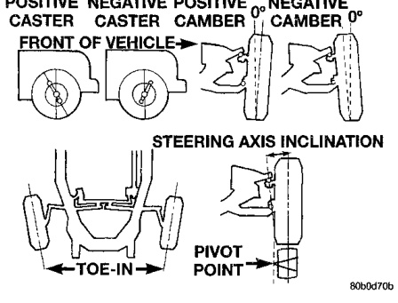

# SUSPENSION 2-1

## CONTENTS

| DESCRIPTION | PAGE |
|-------------|------|
| FRONT SUSPENSION (IFS) | 7 |
| FRONT SUSPENSION LINK/COIL | 14 |
| REAR SUSPENSION | 23 |
| WHEEL ALIGNMENT | 1 |

---

## WHEEL ALIGNMENT

### INDEX

| DESCRIPTION | PAGE |
|-------------|------|
| **DESCRIPTION AND OPERATION** | |
| Wheel Alignment | 1 |
| **DIAGNOSIS AND TESTING** | |
| Pre-Alignment | 3 |
| **SERVICE PROCEDURES** | |
| Alignment IFS Suspension | 3 |
| Alignment Link/Coil Suspension | 4 |
| Cab-Chassis Caster Correction Measurement | 5 |
| **SPECIFICATIONS** | |
| Alignment | 6 |

---

### DESCRIPTION AND OPERATION

#### WHEEL ALIGNMENT

Wheel alignment involves the correct positioning of the wheel in relation to the vehicle. The positioning is accomplished through suspension and steering linkage adjustments. An alignment is considered essential for efficient steering, good directional stability and to minimize tire wear. The most important measurements of an alignment are caster, camber and toe position (Fig. 1) and (Fig. 2).

- **CASTER** is the forward or rearward tilt of the steering knuckle from vertical. Tilting the top of the knuckle rearward provides positive caster. Tilting the top of the knuckle forward provides negative caster. Caster is a directional stability angle which enables the front wheels to return to a straight ahead position after turns.

- **CAMBER** is the inward or outward tilt of the wheel relative to the center of the vehicle. Tilting the top of the wheel inward provides negative camber. Tilting the top of the wheel outward provides positive camber. Incorrect camber will cause wear on the inside or outside edge of the tire.

- **WHEEL TOE POSITION** is the difference between the leading inside edges and trailing inside edges of the front tires. Incorrect wheel toe position is the most common cause of unstable steering and uneven tire wear. The wheel toe position is the **final** front wheel alignment adjustment.

> **CAUTION:** Do not attempt to modify any suspension or steering components by heating and bending.

*Fig. 1 Alignment Angles IFS*
- Caster
- Caster Angle
- Camber
- Camber Angle
- Steering Axis Inclination
- Toe
- Steering and Inclination
