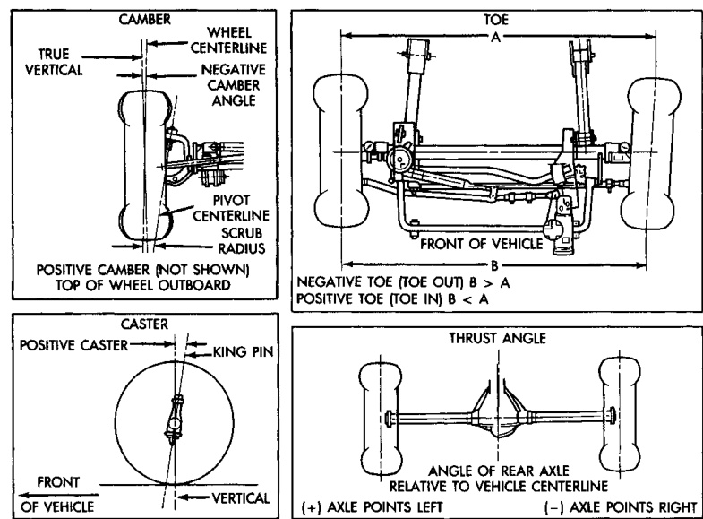

# SUSPENSION 2-2

## DESCRIPTION AND OPERATION (Continued)

*Fig. 2 Alignment Angles Link/Coil*

The figure shows four alignment angle diagrams:

**CAMBER** (top left)
- True vertical reference line
- Wheel centerline showing negative camber angle
- Pivot centerline with scrub radius
- Positive camber (not shown) = top of wheel outboard

**TOE** (top right)
- Front of vehicle reference
- Negative toe (toe out): B > A
- Positive toe (toe in): B < A

**CASTER** (bottom left)
- Positive caster with king pin angle
- Front of vehicle reference
- Vertical reference line

**THRUST ANGLE** (bottom right)
- Angle of rear axle relative to vehicle centerline
- (+) Axle points left
- (-) Axle points right

