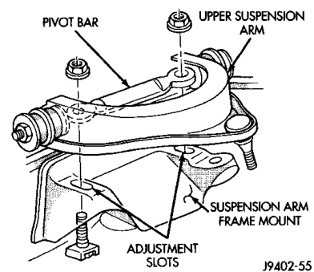

# SUSPENSION 2-4

## SERVICE PROCEDURES (Continued)

*Fig. 3 Caster Camber Adjustment Location*
- Caster/Camber Adjustment
- Pivot Bar
- Frame Rail

**CAMBER:** Move the forward position of the pivot bar in or out. This will change the camber angle significantly and caster angle only slightly. The camber angle should be adjusted as close as possible to the preferred service specification. After adjustment is made tighten pivot bar nuts to specifications.

**TOE POSITION:** The wheel toe position adjustment should be the final adjustment.

1. Start the engine and turn wheels both ways before straightening the wheels. Center and secure the steering wheel and turn off engine.

2. Loosen the tie rod adjustment sleeve clamp bolts/nuts.

> **NOTE:** Each front wheel should be adjusted for one-half of the total toe position specification. This will ensure the steering wheel will be centered when the wheels are positioned straight-ahead.

3. Adjust the wheel toe position by turning the tie rod adjustment sleeves as necessary.

---

### ALIGNMENT LINK/COIL SUSPENSION

Before each alignment reading the vehicle should be jounced (rear first, then front). Grasp each bumper at the center and jounce the vehicle up and down several times. Always release the bumper in the down position. Set the front end alignment to specifications while the vehicle is in its NORMALLY LOADED CONDITION.

**CAMBER:** The wheel camber angle is preset and is not adjustable.

**CASTER:** Check the caster of the front axle for correct angle. Be sure the axle is not bent or twisted. Road test the vehicle and make left and right turn. Observe the steering wheel return-to-center position. Low caster will cause poor steering wheel returnability.

Caster can be adjusted by rotating the cams on the lower suspension arm (Fig. 4). Refer to the Alignment Specification for the correct setting.

*Fig. 4 Cam Adjuster*

**TOE POSITION:** The wheel toe position adjustment should be the final adjustment.

1. Start the engine and turn wheels both ways before straightening the wheels. Center and Secure the steering wheel and turn off engine.

2. Loosen the adjustment sleeve clamp bolts.

> **CAUTION:** Do not loosen/move alignment bar or alignment bar clamp (Fig. 5). The bar is used as a locator for the adjuster clamps.

3. Adjust the right wheel toe position with the drag link (Fig. 5). Turn the sleeve until the right wheel is at the correct TOE-IN position. Position clamp bolts to their original position and tighten to specifications. Make sure the toe setting does not change during clamp tightening.

*Fig. 5 Alignment Bar/Drag Link Adjustment*
