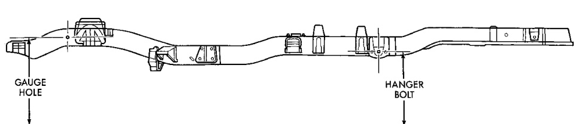

# SUSPENSION 2-5

## SERVICE PROCEDURES (Continued)

4. Adjust left wheel toe position with tie rod at left knuckle. Turn the sleeve until the left wheel is at the correct TOE-IN position. Position clamp bolts to their original position and tighten to specifications. Make sure the toe setting does not change during clamp tightening.

5. Verify the right toe setting.

---

### CAB-CHASSIS CASTER CORRECTION MEASUREMENT

> **NOTE:** To determine the correct caster alignment angle for Cab-Chassis vehicles the following procedure must be performed.

1. Take a height measurement to the center of the front gauge hole in the frame. Take another measurement to the center of the rear spring hanger bolt (Fig. 6). Take these measurements on both sides of the vehicle.

2. Subtract the front measurement from the rear measurement and use the average between the right and left side. Use this number (caster correlation value) with the Corrected Caster Chart to obtain the preferred caster angle.

---

## CORRECTED CASTER CHART/CAB CHASSIS

| Caster Correlation Value (inches) | 4x2 8800 lb. GVW 134.7 in. wheel base (Caster ± 1 deg.) | 4x4 8800 lb. GVW 4x2 & 4x4 11000 lb. GVW 134.7 & 138.7 in. wheel base (Caster ± 1 deg.) | 4x2 & 4x4 11000 lb. GVW 162.7 in. wheel base (Caster ± 1 deg.) |
|---|---|---|---|
| -5.00 | 4.27° | 3.77° | 3.81° |
| -4.75 | 4.39° | 3.89° | 3.91° |
| -4.50 | 4.51° | 4.01° | 4.01° |
| -4.25 | 4.64° | 4.14° | 4.11° |
| -4.00 | 4.76° | 4.26° | 4.21° |
| -3.75 | 4.88° | 4.38° | 4.31° |
| -3.50 | 5.00° | 4.50° | 4.41° |
| -3.25 | 5.12° | 4.62° | 4.51° |
| -3.00 | 5.25° | 4.75° | 4.61° |
| -2.75 | 5.37° | 4.87° | 4.71° |
| -2.50 | 5.49° | 4.99° | 4.81° |
| -2.25 | 5.61° | 5.11° | 4.91° |
| -2.00 | 5.74° | 5.24° | 5.01° |
| -1.75 | 5.86° | 5.36° | 5.11° |
| -1.50 | 5.98° | 5.48° | 5.21° |
| -1.25 | 6.10° | 5.60° | 5.31° |
| -1.00 | 6.23° | 5.73° | 5.41° |
| -0.75 | 6.33° | 5.83° | 5.51° |
| -0.50 | 6.47° | 5.97° | 5.61° |
| -0.25 | 6.59° | 6.09° | 5.71° |
| 0.00 | 6.71° | 6.21° | 5.81° |

*Fig. 2 Chassis Measurement*
- Front Gauge Hole
- Rear Spring Hanger Bolt
