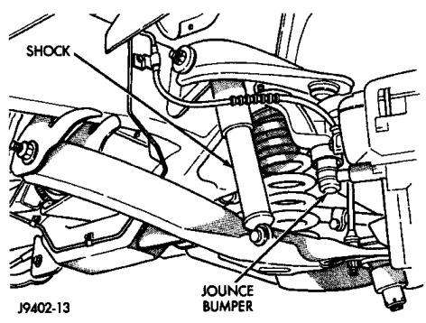

# SUSPENSION 2-7

## FRONT SUSPENSION (IFS)

### INDEX

| DESCRIPTION | PAGE |
|-------------|------|
| **DESCRIPTION AND OPERATION** | |
| Independent Front Suspension (IFS) | 7 |
| **DIAGNOSIS AND TESTING** | |
| Lower Ball Joint | 8 |
| Shock Diagnosis | 8 |
| Upper Ball Joint | 8 |
| **CLEANING AND INSPECTION** | |
| Wheel Bearings | 12 |
| **REMOVAL AND INSTALLATION** | |
| Coil Springs | 9 |
| Lower Suspension Arm | 10 |
| Shock Absorber | 8 |
| Stabilizer Bar | 9 |
| Steering Knuckle | 10 |
| Upper Suspension Arm | 10 |
| Wheel Bearings | 11 |
| Wheel Studs | 11 |
| **DISASSEMBLY AND ASSEMBLY** | |
| Lower Ball Joint | 11 |
| Upper Ball Joint | 12 |
| **SPECIFICATIONS** | |
| Torque Chart | 13 |
| **SPECIAL TOOLS** | |
| IFS Front Suspension | 13 |

---

## DESCRIPTION AND OPERATION

### INDEPENDENT FRONT SUSPENSION (IFS)

The IFS suspension is comprised of (Fig. 1) and (Fig. 2):

- Shock absorbers
- Coil springs
- Upper and lower suspension arms
- Stabilizer bar

*Fig. 1 Independent Front Suspension*
- Shock Absorber
- Coil Spring
- Upper Suspension Arm
- Lower Suspension Arm
- Stabilizer Bar

**Shock Absorbers:** The shock absorbers dampen jounce and rebound of the vehicle over various road conditions. Shocks are mounted on the bottom to the lower suspension arms. The top of the shock mounts on frame brackets using grommets.

**Coil Springs:** The coil springs control ride quality and maintain proper ride height. The springs mount between the lower suspension arm and the front cross member spring seat. A rubber isolator seats on top off the spring to help prevent noise.

*Fig. 2 Independent Front Suspension*

**Suspension Arms:** The suspension arms have replaceable ball studs which are pressed into the arms. Bushings located inboard are not replaceable. The upper arm has a pivot bar which mounts on a frame bracket. The bracket has slotted holes this allows the arm to be adjusted for caster and camber. The suspension arm travel (jounce or rebound) is limited through the use of urethane bumpers.

**Stabilizer Bar:** The stabilizer bar is used to minimize vehicle front sway during turns. The spring steel bar helps to control the vehicle body in relationship to the suspension. The bar extends across the front underside of the chassis and mounts on the frame rails. Links connected the bar to the lower suspension arms. Stabilizer bar mounts are isolated by
