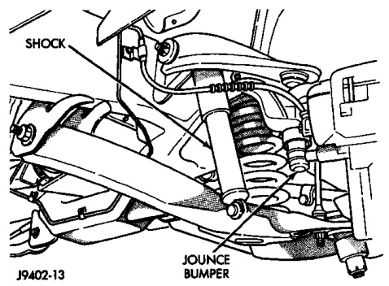

# SUSPENSION 2-9

## REMOVAL AND INSTALLATION (Continued)

*Fig. 3 Shock Absorber*
- Upper Nut
- Grommet
- Retainer
- Shock Absorber
- Lower Bolt

#### INSTALLATION

1. Extend shock fully, install retainer and grommet on top of shock absorber. Check grommets and retainer for wear.

2. Guide shock up through upper suspension arm bracket. Install top grommet, retainer and nut. Tighten nut to 47 N·m (35 ft. lbs.).

3. Align bottom end of shock into lower suspension arm and install mounting bolt. Tighten bolt to 142 N·m (105 ft. lbs.).

4. Remove support and lower vehicle.

---

### COIL SPRINGS

#### REMOVAL

1. Raise and support vehicle.

2. Remove tire and wheel assembly.

3. Remove brake caliper assembly and rotor refer to Group 5 Brakes.

4. Disconnect tie rod from steering knuckle.

5. Disconnect stabilizer bar link from lower suspension arm.

6. Support lower suspension arm outboard end with jack. Place jack under arm in front of shock mount.

7. Remove cotter pin and nut from lower ball joint. Separate ball joint with remover C-4150A.

8. Remove lower shock bolt from suspension arm.

9. Lower jack and suspension arm until spring tension is relieved. Remove spring and rubber isolator (Fig. 4).

*Fig. 4 Coil Spring*

#### INSTALLATION

1. Install rubber isolator on top of spring. Position spring into upper spring seat and lower suspension arm.

2. Raise suspension arm with jack and position shock into suspension arm mount. Install shock bolt and tighten to 135 N·m (100 ft. lbs.).

3. Install steering knuckle on lower ball joint. Install lower ball joint nut and tighten to:
   - LD: 129 N·m (95 ft. lbs.)
   - HD: 136 N·m (110 ft. lbs.)

4. Replace cotter pin and remove jack.

5. Install stabilizer bar link on lower suspension arm. Install grommet, retainer and nut and tighten to 37 N·m (27 ft. lbs.).

6. Install tie rod on steering knuckle and tighten nut to 88 N·m (65 ft. lbs.).

7. Install brake caliper assembly and rotor, refer to Group 5 Brakes.

8. Install tire and wheel assembly.

9. Remove support and lower vehicle.

---

### STEERING KNUCKLE

#### REMOVAL

1. Raise and support vehicle.

2. Remove wheel and tire assembly. Remove the brake caliper, refer to Group 5 Brakes.

3. Remove the wheel hub and bearing assembly from the spindle. Refer to Wheel Hub and Bearings service removal.

4. Remove the cotter pin and nut from the tie-rod end and disconnect tie rod.

5. Remove the cotter pins and nuts from the upper and lower ball joints. Separate upper ball joint from knuckle with remover MD-990635. Separate lower ball joint with remover C-4150A and remove knuckle.

#### INSTALLATION

1. Position knuckle on ball joints and install ball joint nuts.

2. Tighten upper ball joint nut to 81 N·m (60 ft. lbs.) and install cotter pin.

3. Tighten lower ball joint nut to:
   - LD: 129 N·m (95 ft. lbs.)
