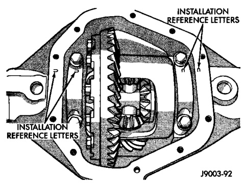
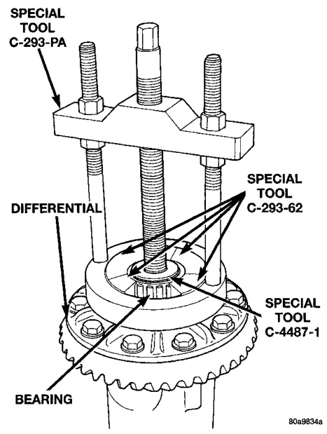
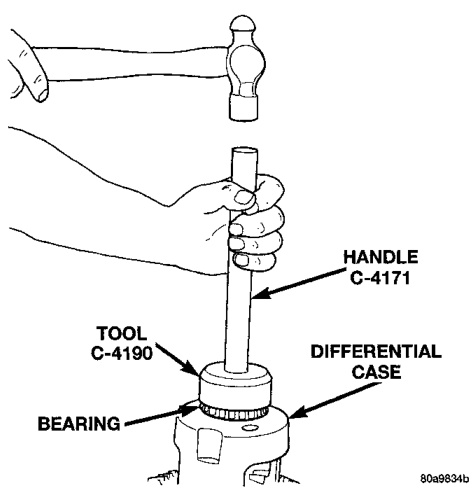

# DIFFERENTIAL AND DRIVELINE 3-100

## REMOVAL AND INSTALLATION (Continued)

*Fig. 14 Differential Bearing Cap Reference Letters*
- Installation Reference Letters
- Housing
- Bearing

---

### DIFFERENTIAL SIDE BEARINGS

#### REMOVAL

(1) Remove differential case from axle housing.

(2) Remove the bearings from the differential case with Puller/Press C-293-PA, Adapters C-293-62, and Step Plate C-4487-1 (Fig. 15).

*Fig. 16 Differential Bearing Removal*
- Special Tool C-293-PA
- Special Tool C-293-62
- Bearing

#### INSTALLATION

(1) Using tool C-4190 with handle C-4171, install differential side bearings (Fig. 16).

*Fig. 15 Install Differential Side Bearings*
- Tool C-4190
- Handle C-4171
- Differential Case

(2) Install differential case in axle housing.

---

### RING GEAR AND EXCITER RING

The ring and pinion gears are service in a matched set. Do not replace the ring gear without replacing the pinion gear.

#### REMOVAL

(1) Remove differential from axle housing.

(2) Place differential case in a suitable vise with soft metal jaw protectors. (Fig. 17)

(3) Remove bolts holding ring gear to differential case.

(4) Using a soft hammer, drive ring gear from differential case (Fig. 17).

(5) Use a brass drift and slowly tap the exciter ring from the differential case.

#### INSTALLATION

> **CAUTION:** Do not reuse the bolts that held the ring gear to the differential case. The bolts can fracture causing extensive damage.

(1) Invert the differential case.

(2) Position exciter ring on differential case.

(3) Using a brass drift, slowly and evenly tap the exciter ring into position.
