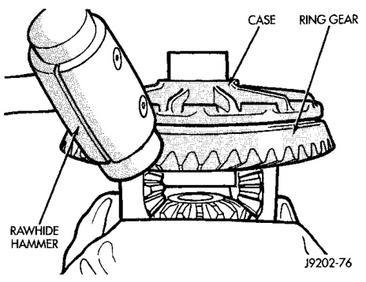
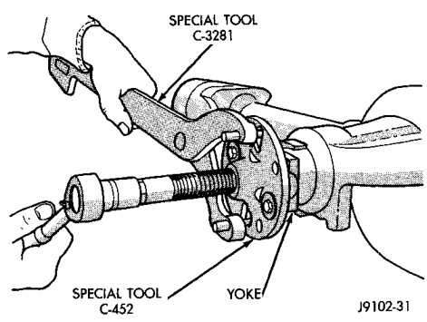
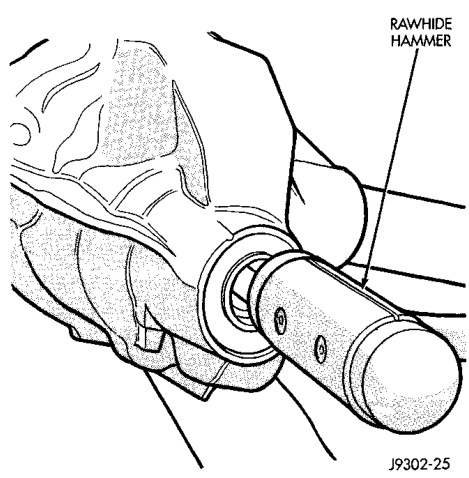
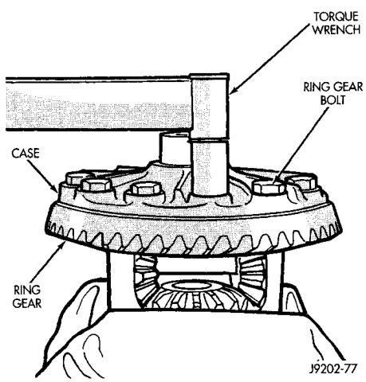

# DIFFERENTIAL AND DRIVELINE 3-101

## REMOVAL AND INSTALLATION (Continued)

*Fig. 17 Ring Gear Removal*
- Ring Gear
- Soft Hammer
- Differential Case

(4) Invert the differential case and start two ring gear bolts. This will provide case-to-ring gear bolt hole alignment.

(5) Invert the differential case in the vise.

(6) Install new ring gear bolts and alternately tighten to 163-190 N·m (120-140 ft. lbs.) torque (Fig. 18).

(7) Install differential in axle housing and verify gear mesh and contact pattern.

*Fig. 18 Ring Gear Bolt Installation*
- Ring Gear
- Differential Case
- Bolts

---

### PINION GEAR

> **NOTE:** The ring and pinion gears are service in a matched set. Do not replace the pinion gear without replacing the ring gear.

#### REMOVAL

(1) Remove differential assembly from axle housing.

(2) Mark pinion yoke and propeller shaft for installation alignment.

(3) Disconnect propeller shaft from pinion yoke. Using suitable wire, tie propeller shaft to underbody.

(4) Using Yoke Holder 6719 to hold yoke, remove the pinion yoke nut and washer.

(5) Using Remover C-452 and Wrench C-3281, remove the pinion yoke from pinion shaft (Fig. 19).

*Fig. 20 Pinion Yoke Removal*
- Remover
- Special Tool C-452
- Yoke

(6) Remove the pinion gear from housing (Fig. 20). Catch the pinion with your hand to prevent it from falling and being damaged.

*Fig. 19 Remove Pinion Gear*
- Rawhide Hammer
- Pinion Gear
