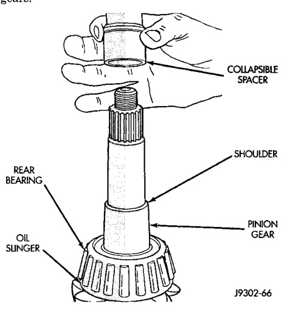
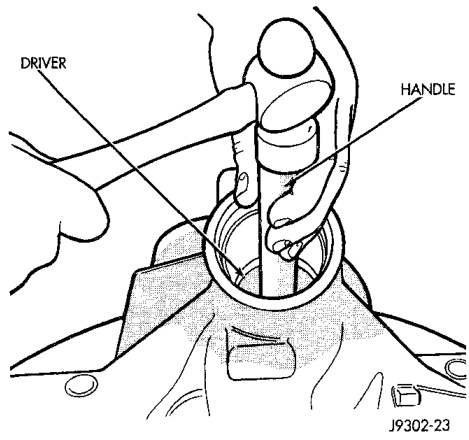
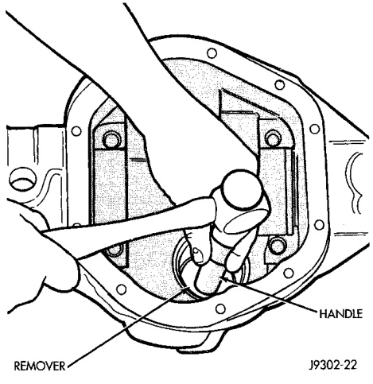
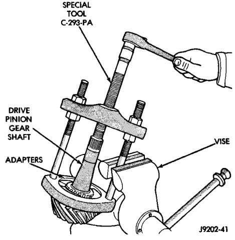

# DIFFERENTIAL AND DRIVELINE 3-102

## REMOVAL AND INSTALLATION (Continued)

(7) Remove the pinion seal with a slide hammer or suitable pry bar.

(8) Remove oil slinger, if equipped, and the front pinion bearing.

(9) Remove the front pinion bearing cup with Remover D-158 and Handle C-4171 (Fig. 21).

*Fig. 22 Front Bearing Cup Removal*
- Remover
- Rear Bearing Cup
- Oil Slinger
- Adapter

(10) Remove the rear bearing cup from housing (Fig. 22). Use Remover D-162 and Handle C-4171.

*Fig. 23 Rear Bearing Cup Removal*
- Remover D-162
- Handle C-4171

(11) Remove the collapsible preload spacer (Fig. 23) from 248 RBI pinion gears.

(12) Remove the solid shims from 267 RBI pinion gears.

*Fig. 21 Collapsible Spacer*
- Collapsible Spacer

(13) Remove the rear bearing from the pinion with Puller/Press C-293-PA and Adapters C-293-37 (Fig. 24).

Place 4 adapter blocks so they do not damage the bearing cage.

*Fig. 24 Inner Bearing Removal*
- Special Tool C-293-PA
- Drive Pinion
- Adapters C-293-37

(14) Remove the pinion depth shims from the pinion gear shaft. Record the total thickness of the depth shims.
