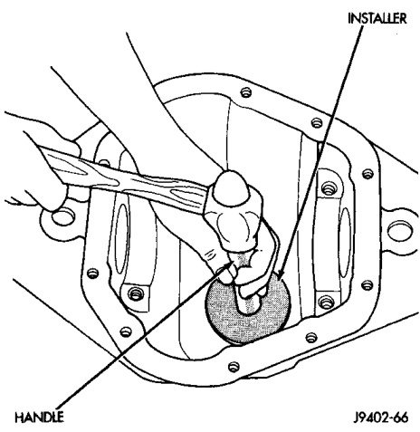
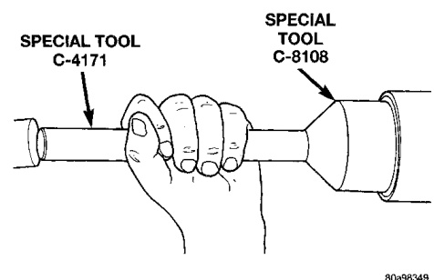
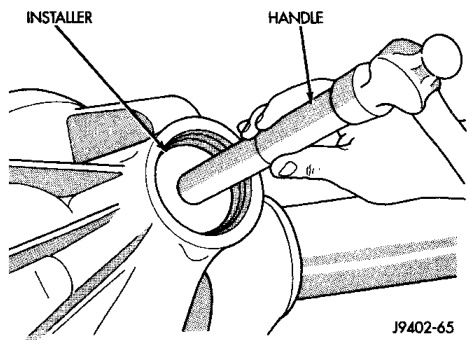
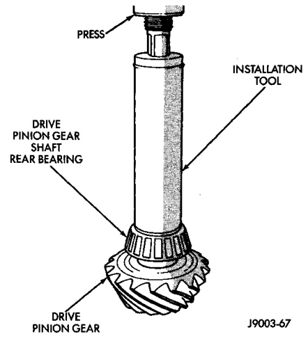

# DIFFERENTIAL AND DRIVELINE 3-103

## REMOVAL AND INSTALLATION (Continued)

#### INSTALLATION

(1) Apply Mopar® Door Ease stick lubricant to outside surface of bearing cup. Install the pinion rear bearing cup with Installer D-111 and Handle C-4171 (Fig. 25). Ensure cup is correctly seated.

*Fig. 25 Pinion Rear Bearing Cup Installation*
- Handle C-4171

(2) Apply Mopar® Door Ease stick lubricant to outside surface of bearing cup. Install the pinion front bearing cup with Installer D-146 and Handle C-4171 (Fig. 26).

*Fig. 26 Pinion Front Bearing Cup Installation*
- Handle
- Installer

(3) Install pinion front bearing and oil slinger, if equipped. Apply a light coating of gear lubricant on the lip of pinion seal.

(4) Install seal with Installer 8108 and Handle C-4171 (Fig. 27).

*Fig. 27 Pinion Seal Installation*
- Special Tool C-4171
- Special Tool 8108

> **NOTE:** Pinion depth shims are placed between the rear pinion bearing cone and pinion gear to achieve proper ring and pinion gear mesh. If the factory installed ring and pinion gears are reused, the pinion depth shim should not require replacement or adjustment. Refer to Pinion Gear Depth paragraph in this section to select the proper thickness shim before installing rear pinion bearing cone.

(5) Place the proper thickness pinion depth shim on the pinion gear.

(6) Install the rear bearing and oil slinger, if equipped, on the pinion gear with Installer C-3095-A (Fig. 28).

*Fig. 28 Shaft Rear Bearing Installation*
- Drive Pinion Gear and Bearing
- Pinion Gear
