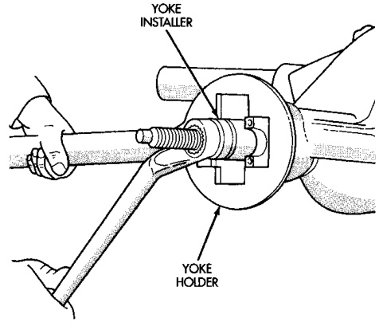
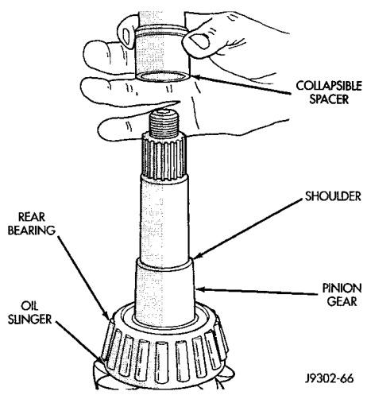

# DIFFERENTIAL AND DRIVELINE 3-104

## REMOVAL AND INSTALLATION (Continued)

(7) Install a new collapsible preload spacer on pinion shaft (Fig. 29) on 248 RBI pinion gears.

(8) Install original solid shims on 267 RBI pinion gears.

(9) Install pinion gear in housing.

*Fig. 30 Collapsible Preload Spacer*
- Spacer
- Housing

(10) Install yoke with Installer C-3718 and Yoke Holder 6719 (Fig. 30).

*Fig. 29 Pinion Yoke Installation*

(11) Install the yoke washer and a new nut on the pinion gear. Tighten the nut to 292 N·m (215 ft. lbs.) minimum. Do not over-tighten. Maximum torque is 447 N·m (330 ft. lbs.).

> **CAUTION:** Never loosen pinion gear nut to decrease pinion gear bearing preload torque and never exceed specified preload torque. If preload torque is exceeded a new pinion nut and collapsible spacer, if equipped, must be installed. The torque sequence will have to be repeated.

(12) Tighten pinion nut as follows for **248 RBI axles**:

(a) Using Yoke Holder 6719, and a torque wrench set at 447 N·m (330 ft. lbs.), crush collapsible spacer until bearing end play is taken up.

(b) Slowly tighten the nut in 6.8 N·m (5 ft. lbs.) increments until the rotating torque is achieved. Measure the rotating torque frequently to avoid over crushing the collapsible spacer (Fig. 31).

(13) Tighten pinion nut as follows for **267 RBI axles**:

(a) If the rotating torque is greater than the desired rotating torque, remove the pinion yoke and decrease the thickness of the solid shim pack. Decreasing the shim pack thickness by 0.025 mm (0.001 in.) will increase the rotating torque approximately 0.9 N·m (8 in. lbs.).

(b) Slowly tighten the nut in 6.8 N·m (5 ft. lbs.) increments until the rotating torque or tightening torque of 447 N·m (330 ft. lbs.) is achieved. Measure the rotating torque frequently to avoid excessively preloading the pinion bearings (Fig. 31).

(c) If the maximum tightening torque is reached prior to achieving the desired rotating torque, remove the pinion yoke and increase the thickness of the solid shim pack. Increasing the shim pack thickness by 0.025 mm (0.001 in.) will decrease the rotating torque approximately 0.9 N·m (8 in. lbs.).

(14) Check bearing rotating torque with an inch pound torque wrench (Fig. 31). The torque necessary to rotate the pinion gear should be:

- Original Bearings — 1 to 3 N·m (10 to 20 in. lbs.).
- New Bearings — 2 to 5 N·m (15 to 35 in. lbs.).

(15) Align previously made marks on yoke and propeller shaft and install propeller shaft.

(16) Install differential housing into the axle housing.

#### FINAL ASSEMBLY

(1) Scrape the residual sealant from the housing and cover mating surfaces. Clean the mating surfaces with mineral spirits. Apply a bead of Mopar® Silicone Rubber Sealant, or equivalent, on the housing cover (Fig. 32).
