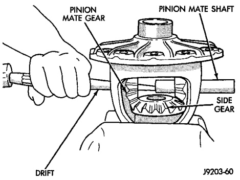
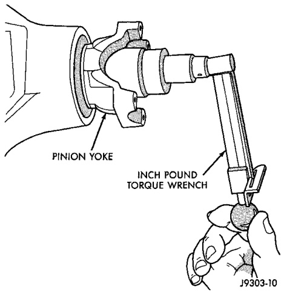
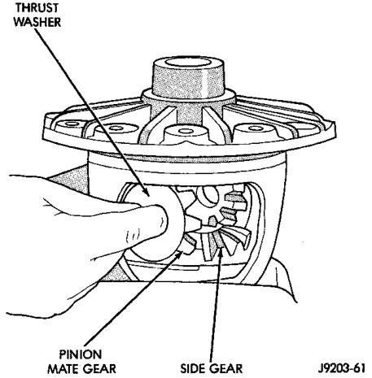
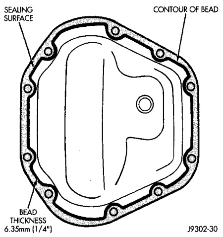

# DIFFERENTIAL AND DRIVELINE 3-105

## REMOVAL AND INSTALLATION (Continued)

*Fig. 32 Check Pinion Gear Rotation Torque*
- Inch Pound Torque Wrench
- Control Of End
- Flange
- Axle Housing

*Fig. 31 Typical Housing Cover With Sealant*
- Sealant
- Cover

Install the housing cover within 5 minutes after applying the sealant.

(2) Install the cover on the differential with the attaching bolts. Install the identification tag. Tighten the cover bolts to 41 N·m (30 ft. lbs.) torque.

> **CAUTION:** Overfilling the differential can result in lubricant foaming and overheating.

(3) Refill the differential housing with gear lubricant. Refer to the Lubricant Specifications section of this group for the gear lubricant requirements.

(4) Install the fill hole plug.

---

## DISASSEMBLY AND ASSEMBLY

### STANDARD DIFFERENTIAL

#### DISASSEMBLY

(1) Remove roll-pin holding mate shaft in housing.

(2) Remove pinion gear mate shaft (Fig. 33).

(3) Rotate the differential side gears and remove the pinion mate gears and thrust washers (Fig. 34).

*Fig. 34 Pinion Mate Shaft Removal*
- Pinion Mate Shaft
- Drift

*Fig. 33 Pinion Mate Gear Removal*
- Thrust Washer
- Mate Gear
- Side Gear
