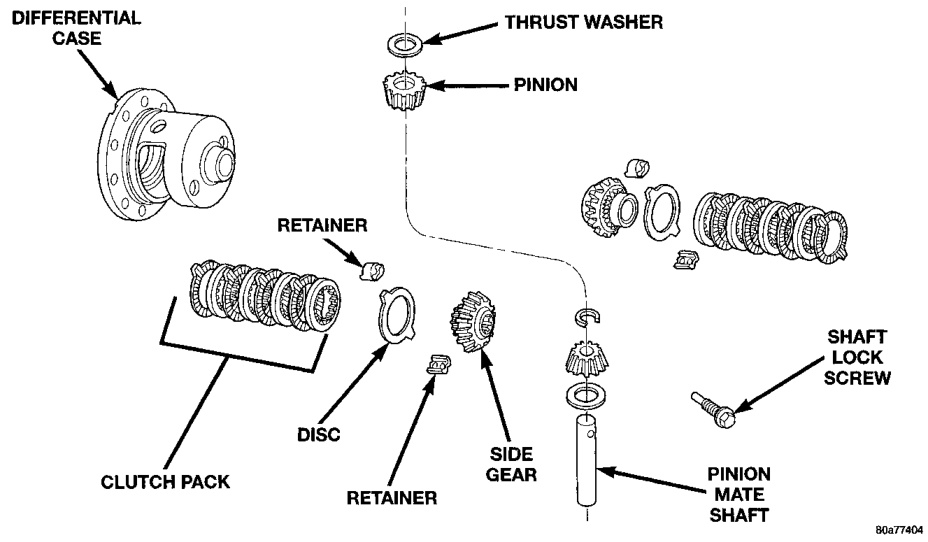
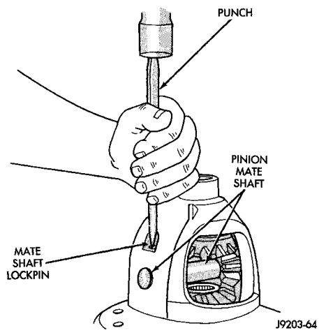

# DIFFERENTIAL AND DRIVELINE 3-106

## DISASSEMBLY AND ASSEMBLY (Continued)

(4) Remove the differential side gears and thrust washers.

#### ASSEMBLY

(1) Install the differential side gears and thrust washers.

(2) Install the pinion mate gears and thrust washers.

(3) Install the pinion gear mate shaft.

(4) Align the hole in the pinion gear mate shaft with the hole in the differential case.

(5) Install and seat the pinion mate shaft roll-pin in the differential case and mate shaft with a punch and hammer (Fig. 35). Peen the edge of the roll-pin hole in the differential case slightly in two places, 180° apart.

(6) Lubricate all differential components with hypoid gear lubricant.

*Fig. 36 Pinion Mate Shaft Roll-Pin Installation*
- Mate Lockpin

*Fig. 35 Trac-Lok Differential Components—Typical*
- Differential Case
- Retainer
- Clutch Pack
- Disc
- Retainer
- Thrust Washer
- Pinion
- Side Gear
- Shaft Lock Screw
- Pinion Mate Shaft
