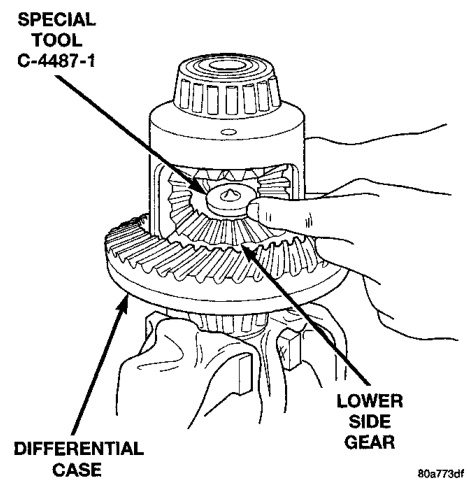
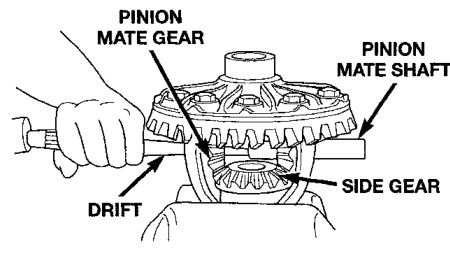
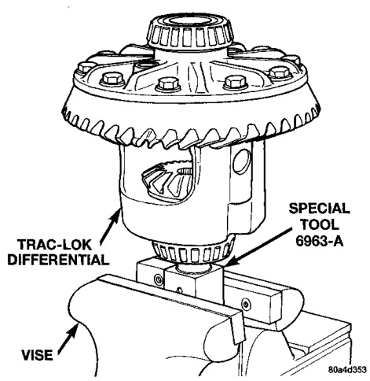
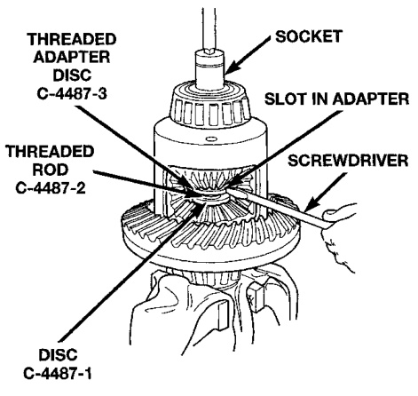

# DIFFERENTIAL AND DRIVELINE 3-107

## DISASSEMBLY AND ASSEMBLY (Continued)

### TRAC-LOK DIFFERENTIAL

The Trac-Lok differential components are illustrated in (Fig. 36). Refer to this illustration during repair service.

#### DISASSEMBLY

(1) Clamp Side Gear Holding Tool 6963-A in a vise.

(2) Position the differential case on Side Gear Holding Tool 6963-A (Fig. 37).

*Fig. 36 Differential Case Holding Tool*
- Trac-Lok Differential
- Special Tool 6963-A
- Special Differential Case

(3) Remove ring gear, if necessary. Ring gear removal is necessary only if the ring gear is to be replaced. The Trac-Lok differential can be serviced with the ring gear installed.

(4) Remove the roll pin holding the pinion mate shaft into the housing.

(5) Remove the pinion gear mate shaft. If necessary, use a drift and hammer (Fig. 38).

*Fig. 39 Mate Shaft Removal*
- Pinion Mate Gear
- Drift
- Pinion Mate Shaft
- Side Gear

(6) Install and lubricate Step Plate C-4487-1 (Fig. 39).

*Fig. 37 Step Plate Tool Installation*
- Special Tool C-4487-1
- Lower Side Gear

(7) Assemble Threaded Adapter C-4487-3 into top side gear. Thread Forcing Screw C-4487-2 into adapter until it becomes centered in adapter plate.

(8) Position a small screw driver in slot of Threaded Adapter C-4487-3 (Fig. 40) to prevent adapter from turning.

*Fig. 38 Threaded Adapter Installation*
- Threaded Adapter C-4487-3
- Threaded Adapter C-4487-2
- Disc C-4487-1
- Socket
- Slot In Adapter
- Screwdriver
