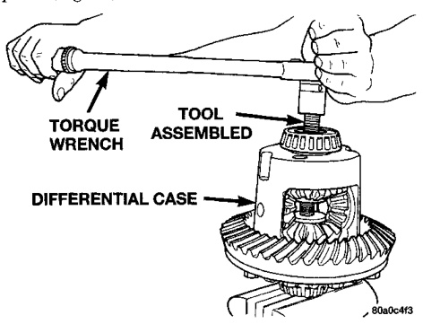
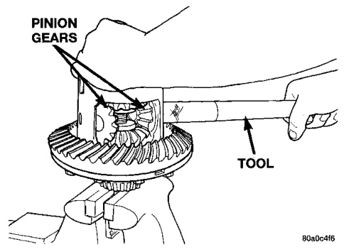
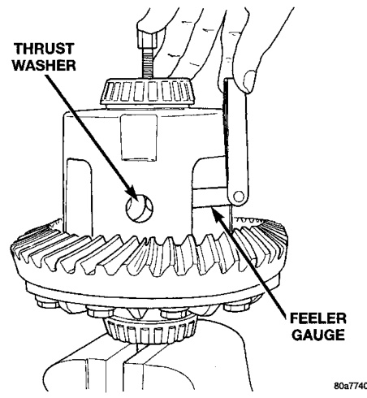
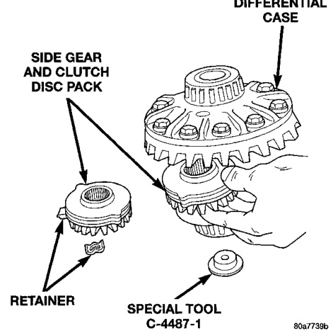

# DIFFERENTIAL AND DRIVELINE 3-108

## DISASSEMBLY AND ASSEMBLY (Continued)

(9) Tighten forcing screw tool 122 N·m (90 ft. lbs.) (maximum) to compress Belleville springs in clutch packs (Fig. 41).

*Fig. 42 Tighten Belleville Spring Compressor Tool*
- Torque Wrench Assembled
- Differential Case
- Pinion Gears
- Tool

(10) Using an appropriate size feeler gauge, remove thrust washers from behind the pinion gears (Fig. 42).

*Fig. 41 Remove Pinion Gear Thrust Washer*
- Thrust Washer
- Feeler Gauge

(11) Insert Turning Bar C-4487-4 in case (Fig. 43).

(12) Loosen the Forcing Screw C-4487-2 in small increments until the clutch pack tension is relieved and the differential case can be turned using Turning Bar C-4487-4.

(13) Rotate differential case until the pinion gears can be removed.

(14) Remove pinion gears from differential case.

*Fig. 43 Pinion Gear Removal*
- Differential Case
- Lower Side Gear
- Disc Pack
- Pinion Gears
- Tool

(15) Remove Forcing Screw C-4487-2, Step Plate C-4487-1, and Threaded Adapter C-4487-3.

(16) Remove top side gear, clutch pack retainer, and clutch pack. Keep plates in correct order during removal (Fig. 44).

*Fig. 44 Side Gear & Clutch Disc Removal*
- Side Gear and Clutch Disc Pack
- Retainer
- Special Tool

(17) Remove differential case from Side Gear Holding Tool 6963-A. Remove side gear, clutch pack retainer, and clutch pack. Keep plates in correct order during removal.

> **NOTE:** The clutch discs are replaceable as complete sets only. If one clutch disc pack is damaged, both packs must be replaced.
