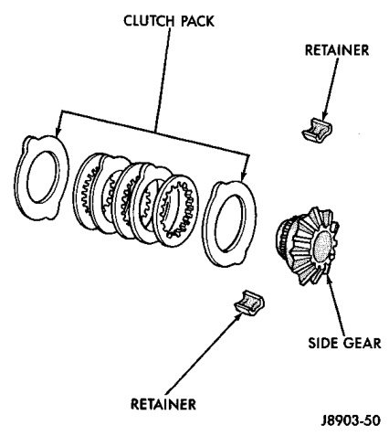
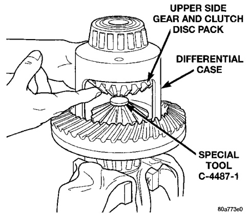
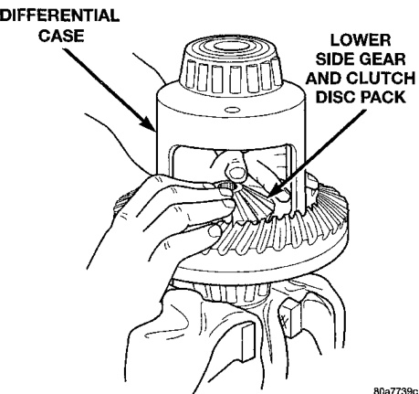

# DIFFERENTIAL AND DRIVELINE 3-109

## DISASSEMBLY AND ASSEMBLY (Continued)

#### ASSEMBLY

Lubricate each component with gear lubricant before assembly.

(1) Assemble the clutch discs into packs and secure disc packs with retaining clips (Fig. 45).

*Fig. 45 Clutch Disc Pack*
- Clutch Pack
- Retainer
- Side Gear

(2) Position assembled clutch disc packs on the side gear hubs.

(3) Install clutch pack and side gear in the ring gear side of the differential case (Fig. 46). Be sure clutch pack retaining clips remain in position and are seated in the case pockets.

*Fig. 46 Clutch Discs & Lower Side Gear Installation*
- Differential Case
- Lower Side Gear
- Disc Pack

(4) Position the differential case on Side Gear Holding Tool 6963-A.

(5) Install lubricated Step Plate C-4487-1 on side gear (Fig. 47).

*Fig. 47 Upper Side Gear & Clutch Disc Pack Installation*
- Upper Side Gear and Clutch Disc Pack
- Differential Case
- Special Tool

(6) Install the upper side gear and clutch disc pack (Fig. 47).

(7) Hold assembly in position. Insert Threaded Adapter C-4487-3 into top side gear.

(8) Insert Forcing Screw C-4487-2.

(9) Tighten forcing screw tool to slightly compress clutch discs.

(10) Place pinion gears in position in side gears and verify that the pinion mate shaft hole is aligned.

(11) Rotate case with Turning Bar C-4487-4 until the pinion mate shaft holes in pinion gears align with holes in case. It may be necessary to slightly tighten the forcing screw in order to install the pinion gears.

(12) Tighten forcing screw to 122 N·m (90 ft. lbs.) to compress the Belleville springs.

(13) Lubricate and install thrust washers behind pinion gears and align washers with a small screw driver. Insert mate shaft into each pinion gear to verify alignment.

(14) Remove forcing screw, threaded adapter, and step plate.

(15) Install pinion gear mate shaft and align holes in shaft and case.

(16) Install the pinion mate shaft roll pin. Peen the edge of roll pin hole in the differential case in two places, 180° apart.

If replacement side and/or pinion gears and thrust washers were installed, it is not necessary to measure the side gear backlash. Correct
