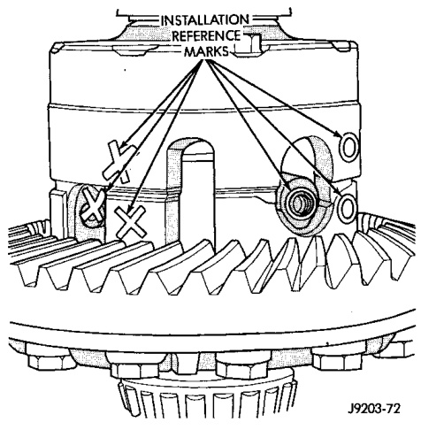
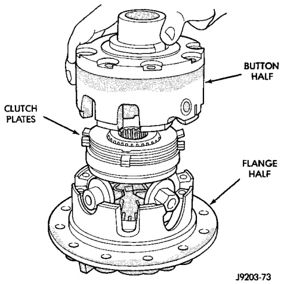

# DIFFERENTIAL AND DRIVELINE 3-110

## DISASSEMBLY AND ASSEMBLY (Continued)

fit is due to close machining tolerances during manufacture.

(17) Lubricate all differential components with hypoid gear lubricant.

---

### POWER-LOK—267 RBI

The 267 RBI Power-Lok differential has a two-piece cross shaft and uses 2 disc and 3 plates for each clutch pack. One plate and one disc in each clutch pack is dished.

#### DISASSEMBLY

Pay close attention to the clutch pack arrangement during this procedure. Note the direction of the concave and convex side of the plates and discs.

(1) Mark the ring gear half and cover half for installation reference (Fig. 48).

*Fig. 49 Case Marked*
- Ring Gear Half
- Button Half

(2) Remove the case attaching bolts and remove the button cover half (Fig. 49).

(3) Remove top clutch pack (Fig. 50).

*Fig. 48 Cover Half Removal*
- Button
- Flange

(4) Remove top side gear clutch ring.

(5) Remove top side gear.

(6) Remove pinion mate gears and cross shafts.

(7) Remove the same parts listed above from the ring gear flange half of the case. Keep these parts with the flange cover half for correct installation in their original positions.

#### ASSEMBLY

The clutch discs are replaceable as complete sets only. If one clutch disc pack is damaged, both packs must be replaced. Lubricate each component with gear lube before assembly and installation.

(1) Saturate the clutch plates with Mopar® Hypoid Gear Lubricant or Additive (Fig. 51). Assemble clutch packs into the side gear plate in exactly the same position as removed (Fig. 50).

(2) Line up the plate ears and install the assembled pack into the flange half (Fig. 52). Ensure that the clutch plate lugs enter the slots in the case. Also ensure that the clutch pack bottoms out on the case.
