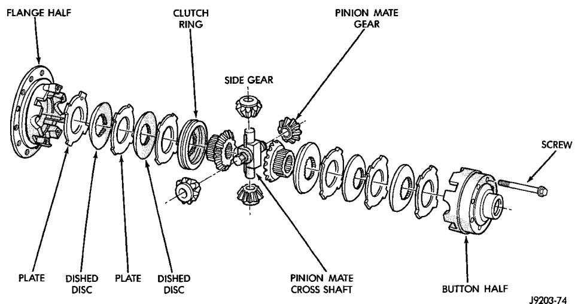
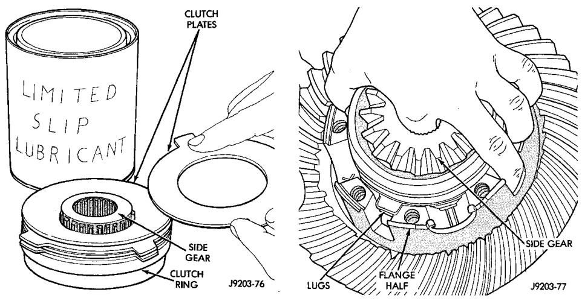

# DIFFERENTIAL AND DRIVELINE 3-111

## DISASSEMBLY AND ASSEMBLY (Continued)

*Fig. 51 Power-Lok Components*
- Flange Half
- Clutch Ring
- Side Gear
- Plate
- Dished Disc
- Plate
- Dished Disc
- Pinion Mate Cross Shaft
- Pinion Mate Gear
- Screw
- Button Half

*Fig. 50 Clutch Pack Power-Lok*
- Clutch Pack
- Side Gear
- Carrier

[Figure: Fig. 52 Clutch Pack Installation]
- Side Gear
- Lugs
