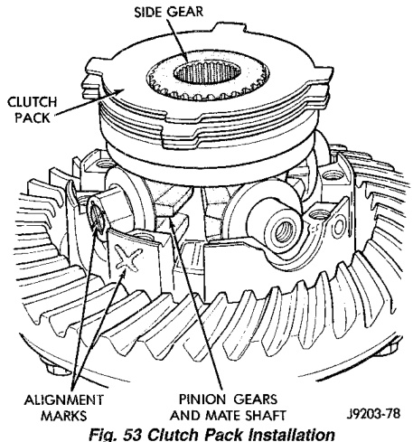
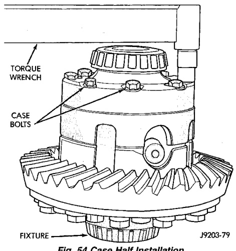

# DIFFERENTIAL AND DRIVELINE 3-112

## DISASSEMBLY AND ASSEMBLY (Continued)

(3) Install pinion mate shafts and pinion mate gears (Fig. 53). Make sure shafts are correctly installed according to the alignment marks.

*Fig. 52 Clutch Pack Installation*
- Side Gear
- Clutch Pack
- Alignment Marks
- Pinion Gears Aligning Mate Shaft

(4) Lubricate and install the other side gear and clutch pack (Fig. 52).

(5) Correctly align and assemble button half to flange half. Install case body screws finger tight.

(6) Tighten body screws alternately and evenly. Tighten screws to 89-94 N·m (65-70 ft. lbs.) torque (Fig. 54).

If bolt heads have 7 radial lines or the number 180 stamped on the head, tighten these bolts to 122-136 N·m (90-100 ft. lbs.) torque.

*Fig. 53 Case Half Installation*
- Torque Wrench
- Case Bolts
- Fixture

---

## CLEANING AND INSPECTION

### AXLE COMPONENTS

Wash differential components with cleaning solvent and dry with compressed air. Do not steam clean the differential components.

Wash bearings with solvent and towel dry, or dry with compressed air. DO NOT spin bearings with compressed air. Cup and bearing must be replaced as matched sets only.

Clean axle shaft tubes and oil channels in housing. Inspect for:

- Smooth appearance with no broken/dented surfaces on the bearing rollers or the roller contact surfaces.
- Bearing cups must not be distorted or cracked.
- Machined surfaces should be smooth and without any raised edges.
- Raised metal on shoulders of cup bores should be removed with a hand stone.
- Wear and damage to pinion gear mate shaft, pinion gears, side gears and thrust washers. Replace as a matched set only.
- Ring and pinion gear for worn and chipped teeth.
- Ring gear for damaged bolt threads. Replaced as a matched set only.
- Pinion yoke for cracks, worn splines, pitted areas, and a rough/corroded seal contact surface. Repair or replace as necessary.
- Preload shims for damage and distortion. Install new shims, if necessary.

### TRAC-LOK/POWER-LOK

Clean all components in cleaning solvent. Dry components with compressed air. Inspect clutch pack plates for wear, scoring or damage. Replace both clutch packs if any one component in either pack is damaged. Inspect side and pinion gears. Replace any gear that is worn, cracked, chipped or damaged. Inspect differential case and pinion shaft. Replace if worn or damaged.

### PRESOAK PLATES AND DISC

Plates and discs with fiber coating (no grooves or lines) must be presoaked in Friction Modifier before assembly. Soak plates and discs for a minimum of 20 minutes.

---

## ADJUSTMENTS

### PINION GEAR DEPTH

#### GENERAL INFORMATION

Ring and pinion gears are supplied as matched sets only. The identifying numbers for the ring and pinion
