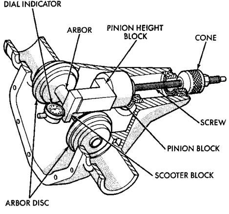
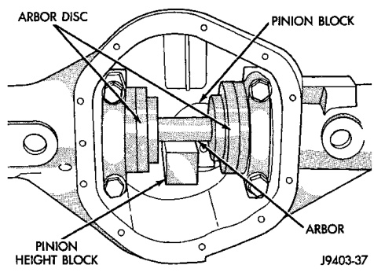
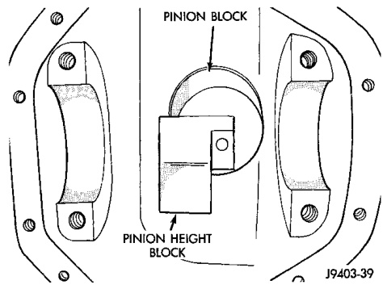

# DIFFERENTIAL AND DRIVELINE 3-114

## ADJUSTMENTS (Continued)

### PINION DEPTH MEASUREMENT AND ADJUSTMENT

Measurements are taken with pinion cups and pinion bearings installed in housing. Take measurements with a Pinion Gauge Set 6730 and Dial Indicator C-3339 (Fig. 57).

*Fig. 57 Pinion Gear Depth Gauge Tools—Typical*
- Dial Indicator
- Arbor
- Pinion Height Block
- Cone
- Screw
- Pinion Block
- Scooter Block
- Arbor Disc

(1) Assemble Pinion Height Block 6739, Pinion Block 6736, and rear pinion bearing onto Screw 6741 (Fig. 57) for the 248 RBI axle. For the 267 RBI axle, use Pinion Block 6737.

(2) Insert assembled height gauge components, rear bearing and screw into axle housing through pinion bearing cups (Fig. 58).

(3) Install front pinion bearing and Cone 6740 hand tight (Fig. 57).

*Fig. 58 Pinion Height Block—Typical*
- Pinion Block
- Pinion Height

(4) Place Arbor Disc 6732 on Arbor D-115-3 in position in axle housing side bearing cradles (Fig. 59). Install differential bearing caps on Arbor Discs and tighten cap bolts. Refer to the Torque Specifications in this section.

> **NOTE:** Arbor Discs 6732 have different step diameters to fit other axle sizes. Pick correct size step for axle being serviced.

*Fig. 59 Gauge Tools In Housing—Typical*
- Arbor Disc
- Pinion Height Block
- Arbor
- Pinion Block

(5) Assemble Dial Indicator C-3339 into Scooter Block D-115-2 and secure set screw.

(6) Place Scooter Block/Dial Indicator in position in axle housing so dial probe and scooter block are flush against the surface of the pinion height block. Hold scooter block in place and zero the dial indicator face to the pointer. Tighten dial indicator face lock screw.

(7) With scooter block still in position against the pinion height block, slowly slide the dial indicator probe over the edge of the pinion height block. Observe how many revolutions counterclockwise the dial pointer travels (approximately 0.125 in.) to the out-stop of the dial indicator.

(8) Slide the dial indicator probe across the gap between the pinion height block and the arbor bar with the scooter block against the pinion height block (Fig. 60). When the dial probe contacts the arbor bar, the dial pointer will turn clockwise. Bring dial pointer back to zero against the arbor bar, do not turn dial face. Continue moving the dial probe to the crest of the arbor bar and record the highest reading. If the dial indicator can not achieve the zero reading, the rear bearing cup or the pinion depth gauge set is not installed correctly.

(9) Select a shim equal to the dial indicator reading plus the drive pinion gear depth variance number etched in the face of the pinion gear (Fig. 55) using the opposite sign on the variance number. For
