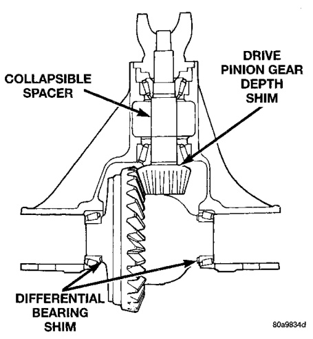
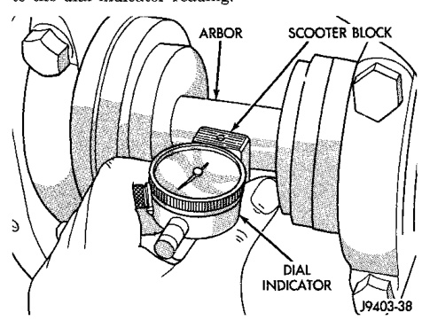
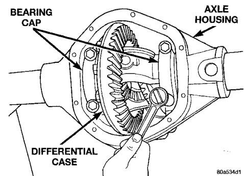

# DIFFERENTIAL AND DRIVELINE 3-115

## ADJUSTMENTS (Continued)

example, if the depth variance is -2, add +0.002 in. to the dial indicator reading.

*Fig. 60 Pinion Gear Depth Measurement—Typical*
- Arbor
- Scooter Block

(10) Remove the pinion depth gauge components from the axle housing.

---

### DIFFERENTIAL BEARING PRELOAD AND GEAR BACKLASH

#### INTRODUCTION

Differential side bearing preload and gear backlash is achieved by selective shims positioned behind the differential side bearing cones. The proper shim thickness can be determined using slip-fit dummy bearings D-343 in place of the differential side bearings and a dial indicator C-3339. Before proceeding with the differential bearing preload and gear backlash measurements, measure the pinion gear depth and prepare the pinion gear for installation. Establishing proper pinion gear depth is essential to establishing gear backlash and tooth contact patterns.

After the overall shim thickness to take up differential side play is measured, the pinion gear is installed, and the gear backlash shim thickness is measured. The overall shim thickness is the total of the dial indicator reading and the preload specification added together. The gear backlash measurement determines the thickness of the shim used on the ring gear side of the differential case. Subtract the gear backlash shim thickness from the total overall shim thickness and select that amount for the pinion gear side of the differential (Fig. 61). Differential shim measurements are performed with axle spreader W-129-B removed.

> **NOTE:** It is difficult to salvage the differential side bearings during the removal procedure. Install replacement bearings if necessary.

*Fig. 61 Axle Adjustment Shim Locations—248 RBI*
- Collapsible Spacer
- Drive Pinion Gear Depth Shim
- Differential Bearing

(1) Remove differential side bearings from differential case.

(2) Remove factory installed shims from differential case.

(3) Install ring gear on differential case and tighten bolts to specification, if necessary.

(4) Install dummy side bearings D-343 on differential case.

(5) Install differential case in axle housing.

(6) Install the marked bearing caps in their correct positions. Install and snug the bolts (Fig. 62).

*Fig. 62 Tighten Bolts Holding Bearing Caps*

(7) Using a dead-blow type mallet, seat the differential dummy bearings to each side of the axle housing (Fig. 63) and (Fig. 64).
