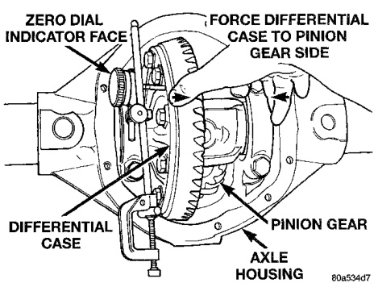
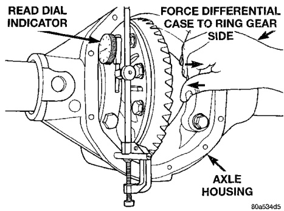
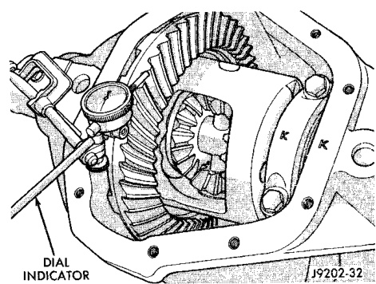

# DIFFERENTIAL AND DRIVELINE 3-117

## ADJUSTMENTS (Continued)

*Fig. 68 Hold Differential Case and Read Dial Indicator*
- Read Dial Indicator
- Force Differential Case to Ring Gear Side
- Axle Housing

*Fig. 69 Hold Differential Case and Zero Dial Indicator*
- Zero Dial Indicator Face
- Force Differential Case to Pinion Gear Side
- Differential Case
- Pinion Gear
- Axle Housing

*Fig. 67 Hold Differential Case and Read Dial Indicator*
- Read Dial Indicator
- Force Differential Case to Ring Gear Side
- Pinion
- Differential Case
- Axle Housing

(25) This is the thickness shim required on the ring gear side of the differential case to achieve proper backlash.

(26) Subtract the backlash shim thickness from the total preload shim thickness. The remainder is the shim thickness required on the pinion side of the axle housing.

(27) Rotate dial indicator out of the way on guide stud.

(28) Remove differential case and dummy bearings from axle housing.

(29) Install side bearing shims on differential case hubs.

(30) Install side bearings and cups on differential case.

(31) Install spreader W-129-B on axle housing and spread axle opening enough to receive differential case.

(32) Install differential case in axle housing.

(33) Remove spreader from axle housing.

(34) Rotate the differential case several times to seat the side bearings.

(35) Position the indicator plunger against a ring gear tooth (Fig. 70).

*Fig. 70 Ring Gear Backlash Measurement*
- Dial Indicator

(36) Push and hold ring gear upward while not allowing the pinion gear to rotate.

(37) Zero dial indicator face to pointer.

(38) Push and hold ring gear downward while not allowing the pinion gear to rotate. Dial indicator reading should be between 0.12 mm (0.005 in.) and 0.20 mm (0.008 in.). If backlash is not within specifications transfer the necessary amount of shim thickness from one side of the axle housing to the other (Fig. 71).

(39) Verify differential case and ring gear runout by measuring ring to pinion gear backlash at several locations around the ring gear. Readings should not vary more than 0.05 mm (0.002 in.). If readings vary
