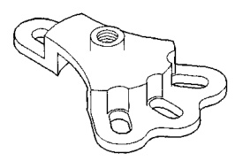
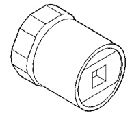
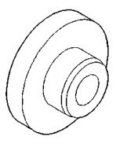
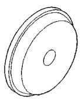

# DIFFERENTIAL AND DRIVELINE 3-120

## SPECIFICATIONS

### 248 AND 267 RBI AXLES

#### 248 RBI AXLE

| DESCRIPTION | SPEC. |
|-------------|-------|
| Axle Type | Hypoid |
| Lubricant | SAE 90W |
| Lube Capacity | 2.96 L (6.25 pts.) |
| Axle Ratio | 3.55, 4.10 |
| **Ring Gear** | |
| Diameter | 247.7 mm (9.75 in.) |
| Backlash | 0.10-0.23 mm (0.004-0.009 in.) |
| Pinion Std. Depth | 127 mm (5.000 in.) |
| **Pinion Bearing Preload** | |
| Original Bearing | 1-3 N·m (10-20 in. lbs.) |
| New Bearing | 2-5 N·m (15-35 in. lbs.) |

#### 267 RBI AXLE

| DESCRIPTION | SPEC. |
|-------------|-------|
| Axle Type | Hypoid |
| Lubricant | SAE 90W |
| Lube Capacity | 3.31 L (7.0 pts.) |
| Axle Ratio | 3.54, 4.10 |
| **Ring Gear** | |
| Diameter | 266.7 mm (10.50 in.) |
| Backlash | 0.10-0.23 mm (0.004-0.009 in.) |
| Pinion Std. Depth | 136.53 mm (5.375 in.) |
| **Pinion Bearing Preload** | |
| Original Bearing | 1-3 N·m (10-20 in. lbs.) |
| New Bearing | 2-5 N·m (15-35 in. lbs.) |

#### 248 AND 267 RBI AXLE

| DESCRIPTION | TORQUE |
|-------------|--------|
| Fill Hole Plug | 34 N·m (25 ft. lbs.) |
| Diff. Cover Bolt | 41 N·m (30 ft. lbs.) |
| Bearing Cap Bolt | 109 N·m (80 ft. lbs.) |
| Pinion Nut | 292-447 N·m (215-330 ft. lbs.) |
| Ring gear Bolt | 163-190 N·m (120-140 ft. lbs.) |
| Axle to Hub Bolt | 122 N·m (90 ft. lbs.) |
| Power-lok Body Screws | See Procedure |
| Hub Nut | 163-190 N·m (120-140 ft. lbs.) |

---

## SPECIAL TOOLS

### 248 AND 267 RBI AXLES

*Fig. 1 Puller—6790*

*Fig. 2 Wrench—DD-1241-JD*

*Fig. 3 Installer—5064*

*Fig. 4 Installer—8151*
