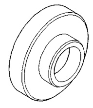
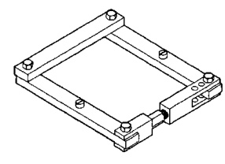
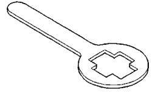
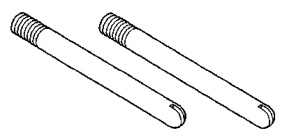
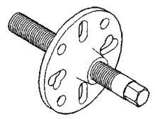
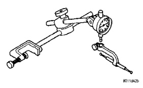
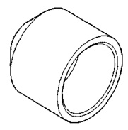
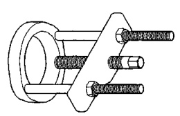

# DIFFERENTIAL AND DRIVELINE 3-121

## SPECIAL TOOLS (Continued)

*Fig. 1 Installer—8149*

*Fig. 2 Spreader—W-129-B*

*Fig. 3 Holder—6719*

*Fig. 4 Guide Pin—C-3288-B*

*Fig. 5 Puller—C-452*

*Fig. 6 Dial Indicator—C-3339*

*Fig. 7 Installer—8108*

*Fig. 8 Puller/Press—C-293-PA*
