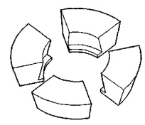
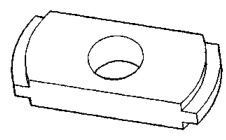
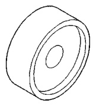
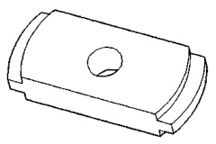
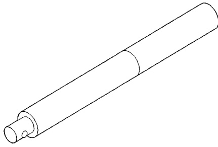
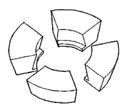
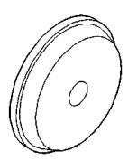
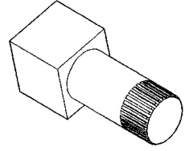

# DIFFERENTIAL AND DRIVELINE 3-122

## SPECIAL TOOLS (Continued)

*Fig. 1 Adapters—C-293-62*

*Fig. 2 Remover—D-158*

*Fig. 3 Installer—C-4190*

*Fig. 4 Remover—D-162*

*Fig. 5 Handle—C-4171*

*Fig. 6 Adapters—C-293-37*

*Fig. 7 Holder—6963-A*

*Fig. 8 Installer—D-111*
