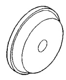
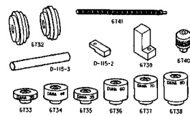
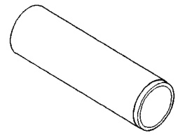
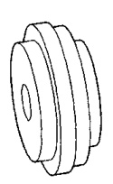
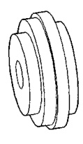
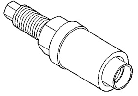

# DIFFERENTIAL AND DRIVELINE 3-123

## SPECIAL TOOLS (Continued)

*Fig. 1 Installer—D-146*

*Fig. 2 Gauge Set—6730 (Pinion Height Set)*
- 6732
- D-115-3
- D-115-2
- 6739
- 6740
- 6741
- 6733
- 6734
- 6735
- 6736
- 6737
- 6738

*Fig. 3 Installer—C-3095-A*

*Fig. 4 Arbor Discs—6732*

*Fig. 5 Installer—C-3718*

*Fig. 6 Trac-lok Tools—C-4487*
