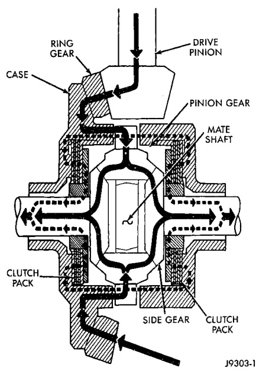

# DIFFERENTIAL AND DRIVELINE 3-126

## DESCRIPTION AND OPERATION (Continued)

*Fig. 3 Trac-lok Limited Slip Differential Operation*
- Ring Gear
- Drive Pinion
- Case
- Clutch
- Side Gear

tional torque to the wheel having the most traction. Trac-lok differentials resist wheel spin on bumpy roads and provide more pulling power when one wheel loses traction. Pulling power is provided continuously until both wheels lose traction. If both wheels slip due to unequal traction, Trac-lok operation is normal. In extreme cases of differences of traction, the wheel with the least traction may spin.

---

## DIAGNOSIS AND TESTING

### GENERAL INFORMATION

Axle bearing problem conditions are usually caused by:

- Insufficient or incorrect lubricant.
- Foreign matter/water contamination.
- Incorrect bearing preload torque adjustment.
- Incorrect backlash.

Axle gear problem conditions are usually the result of:

- Insufficient lubrication.
- Incorrect or contaminated lubricant.
- Overloading (excessive engine torque) or exceeding vehicle weight capacity.
- Incorrect clearance or backlash adjustment.

Axle component breakage is most often the result of:

- Severe overloading.
- Insufficient lubricant.
- Incorrect lubricant.
- Improperly tightened components.

### GEAR NOISE

Axle gear noise can be caused by insufficient lubricant, incorrect backlash, tooth contact, or worn/damaged gears.

Gear noise usually happens at a specific speed range. The range is 30 to 40 mph, or above 50 mph. The noise can also occur during a specific type of driving condition. These conditions are acceleration, deceleration, coast, or constant load.

When road testing, accelerate the vehicle to the speed range where the noise is the greatest. Shift out-of-gear and coast through the peak-noise range. If the noise stops or changes greatly:

- Check for insufficient lubricant.
- Incorrect ring gear backlash.
- Gear damage.

Differential side and pinion gears can be checked by turning the vehicle. They usually do not cause noise during straight-ahead driving when the gears are unloaded. The side gears are loaded during vehicle turns. A worn pinion gear mate shaft can also cause a snapping or a knocking noise.

### BEARING NOISE

The axle shaft, differential and pinion gear bearings can all produce noise when worn or damaged. Bearing noise can be either a whining, or a growling sound.

Pinion gear bearings have a constant-pitch noise. This noise changes only with vehicle speed. Pinion bearing noise will be higher because it rotates at a faster rate. Drive the vehicle and load the differential. If bearing noise occurs, the rear pinion bearing is the source of the noise. If the bearing noise is heard during a coast, the front pinion bearing is the source.

Worn or damaged differential bearings usually produce a low pitch noise. Differential bearing noise is similar to pinion bearing noise. The pitch of differential bearing noise is also constant and varies only with vehicle speed.

Axle shaft bearings produce noise and vibration when worn or damaged. The noise generally changes when the bearings are loaded. Road test the vehicle. Turn the vehicle sharply to the left and to the right. This will load the bearings and change the noise level. Where axle bearing damage is slight, the noise is usually not noticeable at speeds above 30 mph.
