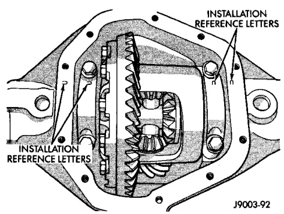
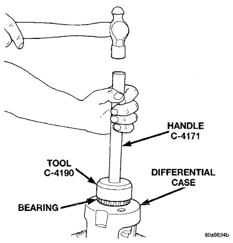
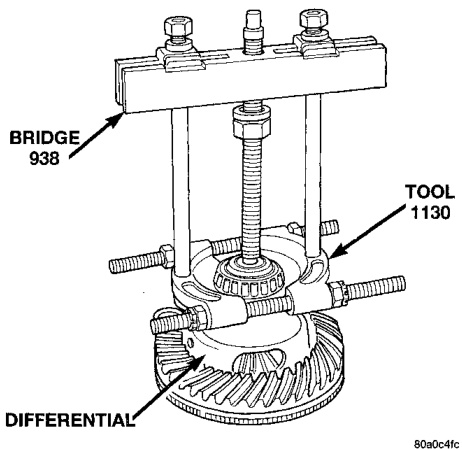
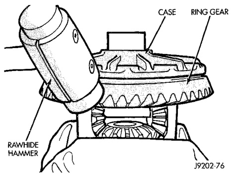

# DIFFERENTIAL AND DRIVELINE 3-135

## REMOVAL AND INSTALLATION (Continued)

*Fig. 14 Differential Bearing Cap Reference Letters*
- Installation Reference Letters

---

### DIFFERENTIAL SIDE BEARINGS

#### REMOVAL

(1) Remove differential case from axle housing.

(2) Remove the bearings from the differential case with Press 938 and Bearing Splitter 1130 (Fig. 15).

*Fig. 15 Differential Bearing Removal*
- Press 938
- Splitter 1130
- Differential

#### INSTALLATION

If ring and pinion gears have been replaced, verify differential side bearing preload and gear mesh backlash.

(1) Using tool C-4190 with handle C-4171, install differential side bearings (Fig. 16).

(2) Install differential in axle housing.

*Fig. 16 Install Differential Side Bearings*
- Handle C-4171
- Tool C-4190
- Bearing
- Differential Case

---

### RING GEAR AND EXCITER RING

#### REMOVAL

(1) Remove the differential case from axle housing.

(2) Clamp the differential case in a vise equipped with soft jaws.

(3) Remove and discard the ring gear bolts.

(4) Tap the ring gear off with a rawhide or plastic mallet (Fig. 17).

*Fig. 17 Ring Gear Removal*
- Case
- Rawhide Hammer
