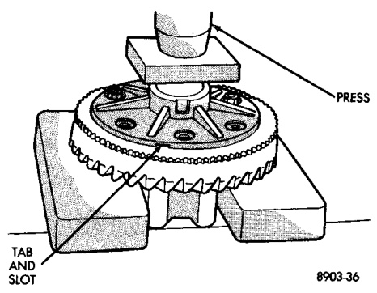
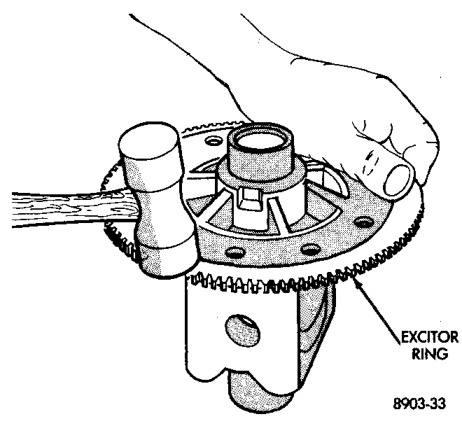
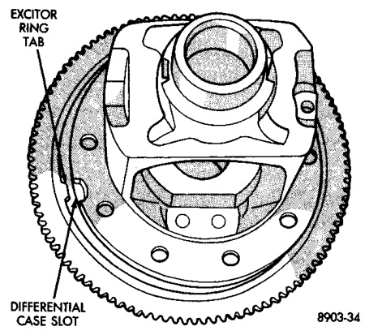
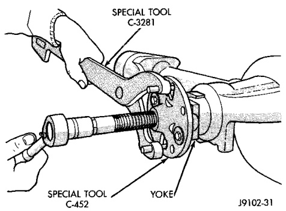

# DIFFERENTIAL AND DRIVELINE 3-136

## REMOVAL AND INSTALLATION (Continued)

(5) The exciter ring can be removed with a soft-faced hammer (Fig. 18). Discard exciter ring after removal.

*Fig. 19 Exciter Ring Removal*
- Soft Faced Hammer
- Exciter Ring

#### INSTALLATION

(1) If exciter ring was removed, align exciter ring tab with slot in differential case (Fig. 19).

*Fig. 18 Exciter Ring Alignment*
- Exciter Ring
- Differential Case
- Tab
- Slot

(2) Invert the differential case and start two ring gear bolts. This will provide case to ring gear bolt hole alignment.

(3) Press the exciter ring onto the differential case using the ring gear as a pilot (Fig. 20).

*Fig. 20 Ring Gear Bolt Hole Alignment*

(4) Install new ring gear bolts and alternately tighten to 272-325 N·m (200-240 ft. lbs.) torque.

---

### PINION GEAR

#### REMOVAL

(1) Remove differential assembly from axle housing.

(2) Remove the pinion yoke nut and washer. Use Remover C-452 and Wrench C-3281 to remove the pinion yoke (Fig. 21).

*Fig. 21 Pinion Yoke Removal*
- Special Tool
- Yoke
