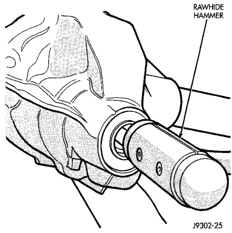
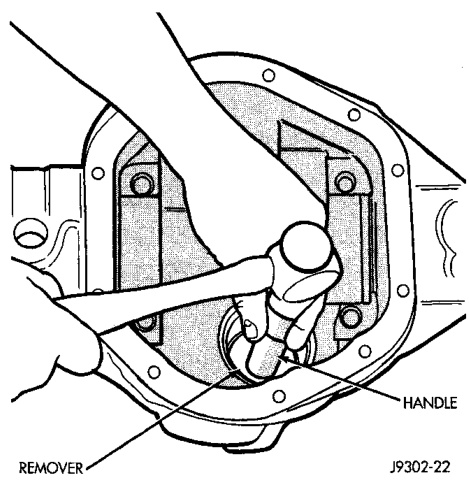
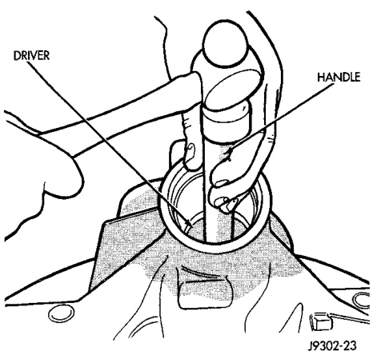

# DIFFERENTIAL AND DRIVELINE 3-137

## REMOVAL AND INSTALLATION (Continued)

(3) Remove the pinion gear from housing (Fig. 22). Catch the pinion with your hand to prevent it from falling and being damaged.

*Fig. 22 Remove Pinion Gear*
- Soft Faced Hammer
- Drive Pinion

(4) Remove the pinion gear seal with a slide hammer or pry out with bar.

(5) Remove oil slinger, front bearing.

(6) Remove the front pinion bearing cup and seal with Remover C-4307 (Fig. 23).

*Fig. 24 Front Bearing Cup Removal*
- Remover
- Handle

(7) Using Remover D-159, remove the rear bearing cup from housing (Fig. 24).

*Fig. 23 Rear Bearing Cup Removal*
- Remover
- Handle

(8) Remove the preload shims (Fig. 25).

(9) Remove the inner bearing from the pinion with Splitter 1130 and Bridge 938 (Fig. 26).

(10) Remove the depth shims from the pinion gear shaft. Record the thickness of the depth shims.

#### INSTALLATION

After selecting the proper pinion depth shim using the Pinion Depth Measurement paragraph in the Adjustment section of this Group, proceed with installation procedure.

(1) Place pinion depth shims in axle housing rear bearing bore.

(2) Install the pinion rear bearing cup with Installer C-4204 (Fig. 27). Ensure cup is correctly seated.
