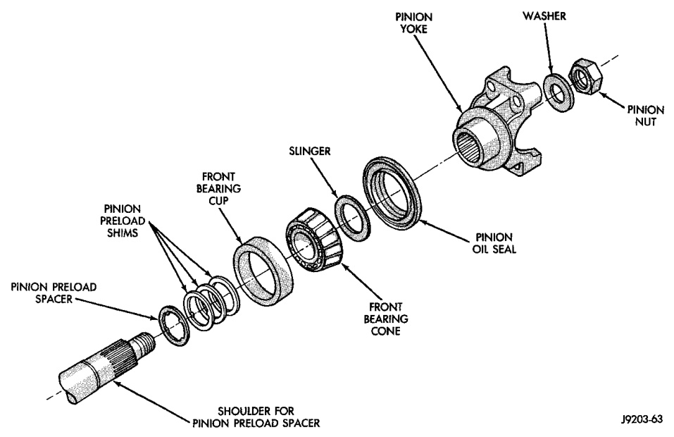
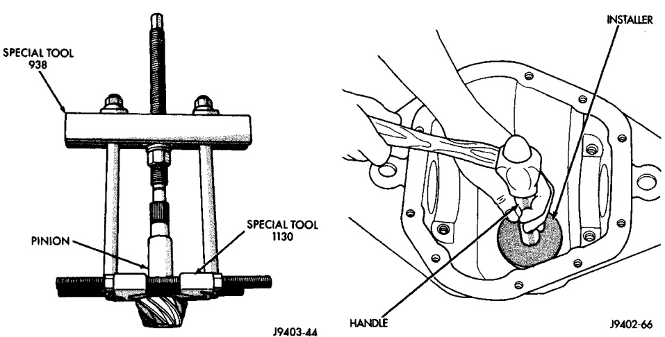

# DIFFERENTIAL AND DRIVELINE 3-138

## REMOVAL AND INSTALLATION (Continued)

*Fig. 26 Pinion Preload Shims*
- Pinion Nut
- Washer
- Slinger
- Pinion Oil Seal
- Front Bearing Cone
- Pinion Preload Spacer
- Shoulder for Pinion Preload Spacer

*Fig. 25 Inner Bearing Removal*
- Special Tool
- Special Tool 1130
- Pinion

[Figure: Fig. 27 Pinion Rear Bearing Cup Installation]
- Installer
- Handle
