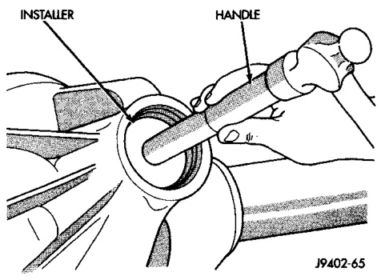
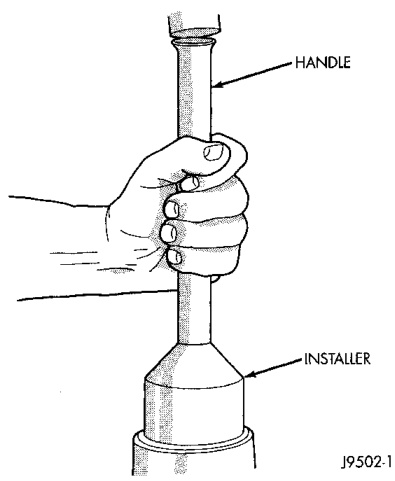
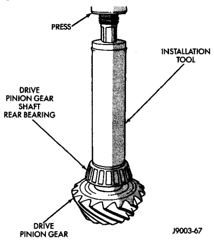

# DIFFERENTIAL AND DRIVELINE 3-139

## REMOVAL AND INSTALLATION (Continued)

(3) Install the pinion front bearing cup with Installer C-4308 (Fig. 28).

*Fig. 28 Pinion Front Bearing Cup Installation*
- Installer
- Handle

(4) Install pinion front bearing and oil slinger, if equipped.

(5) Apply a light coating of gear lubricant on the lip of pinion seal. Install seal with Installer D-187-B and Handle C-4171 (Fig. 29).

*Fig. 30 Pinion Seal Installation*
- Installer
- Handle

(6) Install the rear bearing and slinger, if equipped, on the pinion gear with Installer D-389 (Fig. 30).

*Fig. 29 Shaft Rear Bearing Installation*
- Drive Pinion Gear and Rear Bearing
- Installation Tool D-389

(7) Install pinion bearing preload shims (Fig. 31).

(8) Install yoke with Installer D-191 (Fig. 32).

(9) Install the yoke washer and a new nut on the pinion gear. Install yoke washer with concave surface against the yoke.
