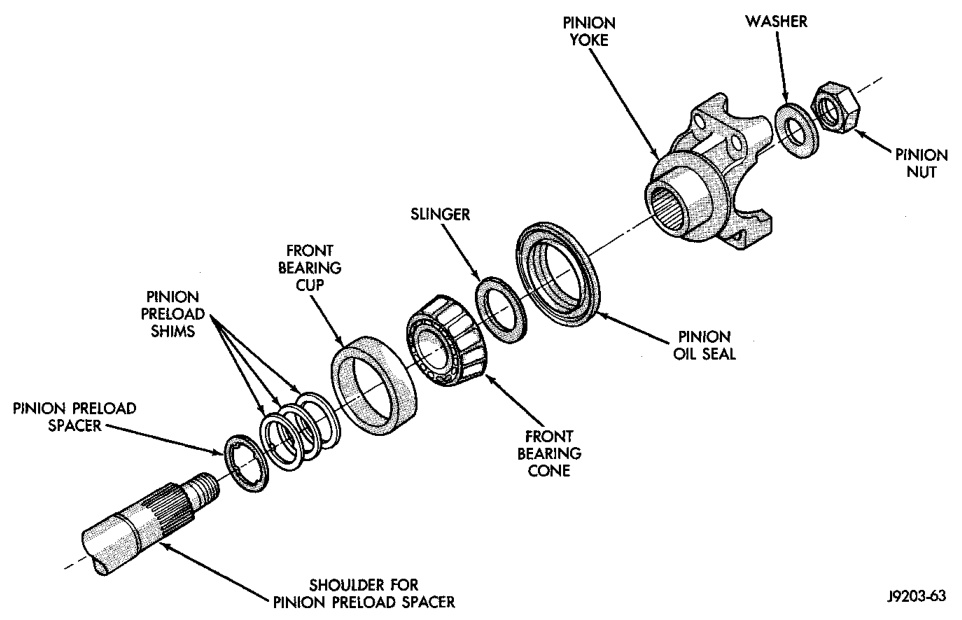
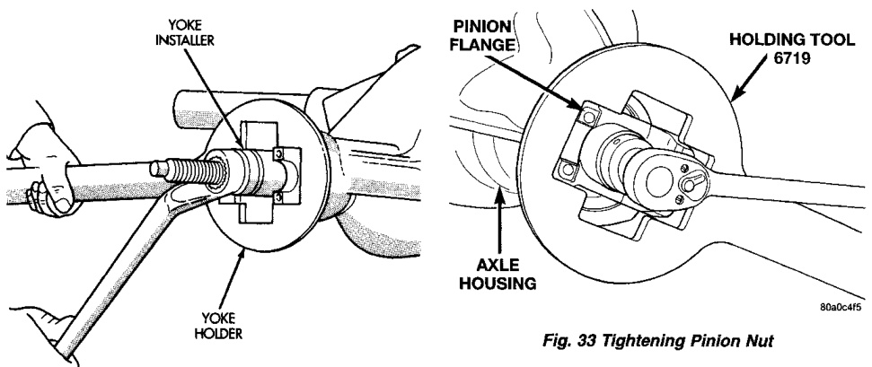

# DIFFERENTIAL AND DRIVELINE 3-140

## REMOVAL AND INSTALLATION (Continued)

*Fig. 32 Pinion Preload Shims*
- Pinion Nut
- Washer
- Slinger
- Front Bearing Cup
- Pinion Oil Seal
- Front Bearing Cone
- Pinion Preload Spacer
- Shoulder for Pinion Preload Spacer

*Fig. 31 Pinion Yoke Installation*
- Yoke Installer
- Yoke Holder

[Figure: Fig. 33 Tightening Pinion Nut]
- Pinion Flange
- Holding Tool 6719
- Axle Housing
