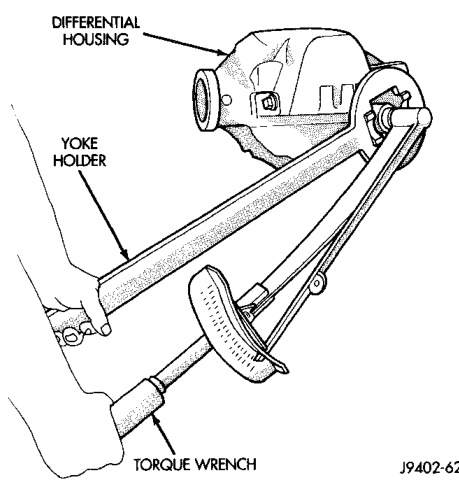
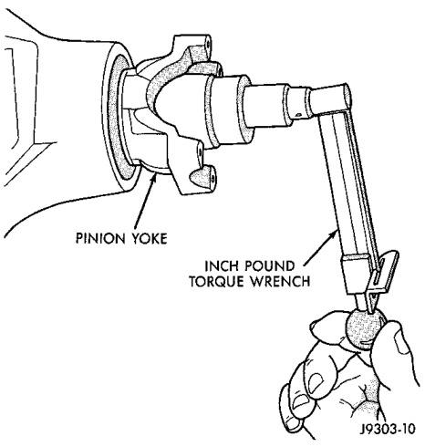
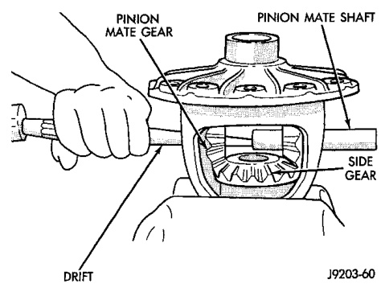

# DIFFERENTIAL AND DRIVELINE 3-141

## REMOVAL AND INSTALLATION (Continued)

(10) Hold pinion yoke with Yoke Holder 6719 and tighten shaft nut to 597 N·m (440 ft. lbs.) (Fig. 34). Rotate pinion shaft several revolutions to ensure the bearing rollers are seated.

(11) Check bearing preload torque with an inch pound torque wrench (Fig. 35). The torque necessary to rotate the pinion gear should be:

- Original Bearings—1 to 3 N·m (10 to 20 in. lbs.).
- New Bearings—2 to 5 N·m (15 to 35 in. lbs.).

(12) If rotating torque is above the desired amount, remove the pinion yoke and increase the preload shim pack thickness. Increasing the shim pack thickness 0.025 mm (0.001 in.) will decrease the rotating torque approximately 0.9 N·m (8 in. lbs.).

(13) Tighten pinion shaft nut in 6.8 N·m (5 ft. lbs.) increments until the maximum tightening or desired rotating torque is reached.

(14) If the maximum tightening torque is reached prior to achieving the desired tightening torque, remove the pinion yoke and decrease the thickness of the preload shim pack. Decreasing the shim pack thickness 0.025 mm (0.001 in.) will increase the rotating torque approximately 0.9 N·m (8 in. lbs.).

*Fig. 35 Tighten Pinion Nut*
- Case Wrench
- Holder 6719

*Fig. 34 Check Pinion Gear Rotation Torque*
- Torque Wrench

---

## DISASSEMBLY AND ASSEMBLY

### STANDARD DIFFERENTIAL

#### DISASSEMBLY

(1) Remove roll-pin holding mate shaft in housing.

(2) Remove pinion gear mate shaft (Fig. 36).

(3) Rotate the differential side gears and remove the pinion mate gears and thrust washers (Fig. 37).

*Fig. 36 Pinion Mate Shaft Removal*

(4) Remove the differential side gears and thrust washers.

#### ASSEMBLY

(1) Install the differential side gears and thrust washers.

(2) Install the pinion mate gears and thrust washers.

(3) Install the pinion gear mate shaft.

(4) Align the hole in the pinion gear mate shaft with the hole in the differential case.

(5) Install and seat the pinion mate shaft roll-pin in the differential case and mate shaft with a punch and hammer (Fig. 38). Peen the edge of the roll-pin hole in the differential case slightly in two places, 180° apart.
