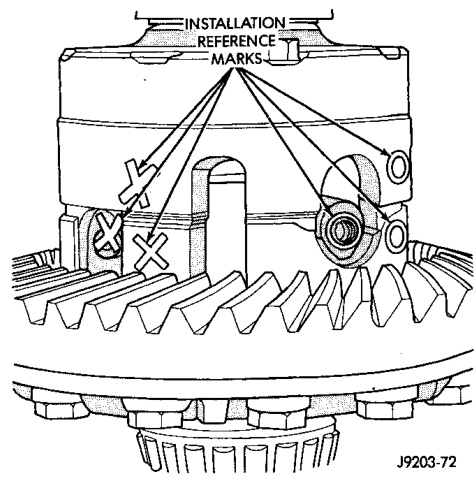
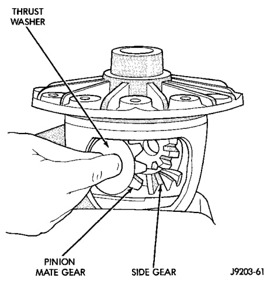
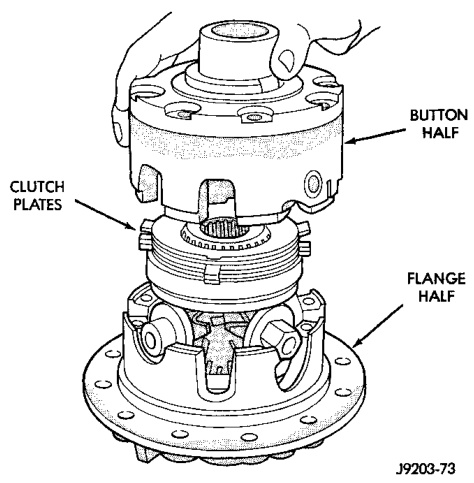
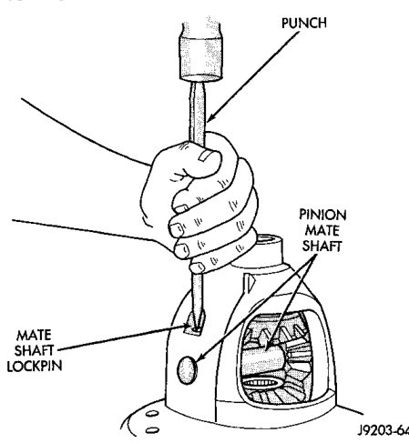

# DIFFERENTIAL AND DRIVELINE 3-142

## DISASSEMBLY AND ASSEMBLY (Continued)

*Fig. 38 Pinion Mate Gear Removal*
- Thrust Washer
- Pinion Mate Gear
- Side Gear

(6) Lubricate all differential components with hypoid gear lubricant.

*Fig. 37 Pinion Mate Shaft Roll-Pin Installation*
- Pinion
- Pinion Mate Lockpin

---

### TRAC-LOK DIFFERENTIAL

The 286 RBI Trac-Lok differential has a one-piece cross shaft and uses 6 disc and 5 plates for each clutch pack. Only one disc in each clutch pack is dished.

#### DISASSEMBLY

Pay close attention to the clutch pack arrangement during this procedure. Note the direction of the concave and convex side of the plates and discs.

(1) Mark the ring gear half and cover half for installation reference (Fig. 39).

*Fig. 40 Case Marked*
- Installation Reference
- Button Half

(2) Remove the case attaching bolts and remove the button cover half (Fig. 40).

*Fig. 39 Cover Half Removal*
- Button
- Clutch
- Flange
