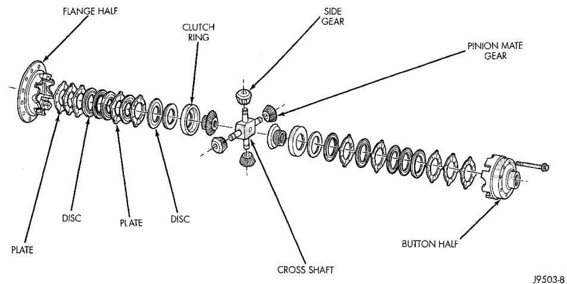
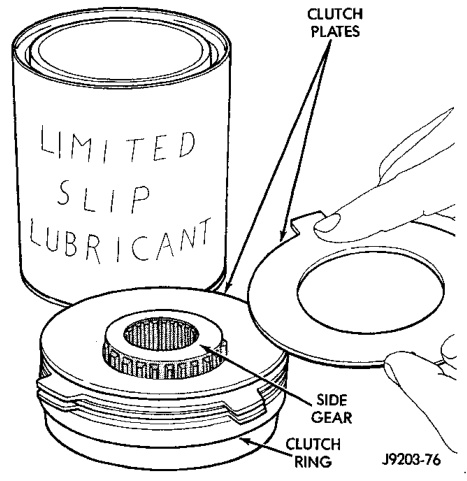

# DIFFERENTIAL AND DRIVELINE 3-143

## DISASSEMBLY AND ASSEMBLY (Continued)

*Fig. 41 Trac-Lok Components*
- Flange Half
- Clutch Ring
- Side Gear
- Disc
- Plate
- Disc
- Button Half
- Cross Shaft
- Pinion Mate Gear

(3) Remove top clutch pack (Fig. 41).

(4) Remove top side gear clutch ring.

(5) Remove top side gear.

(6) Remove pinion mate gears and cross shaft.

(7) Remove the same parts listed above from the ring gear flange half of the case. Keep these parts with the flange cover half for correct installation in their original positions.

#### ASSEMBLY

The clutch discs are replaceable as complete sets only. If one clutch disc pack is damaged, both packs must be replaced. Lubricate each component with gear lube before assembly and installation.

(1) Saturate the clutch plates with Mopar® Hypoid Gear Lubricant or Additive (Fig. 42). Assemble clutch packs into the side gear plate in exactly the same position as removed (Fig. 41).

(2) Line up the plate ears and install the assembled pack into the flange half (Fig. 43). Make sure the clutch plate lugs enter the slots in the case. Also make sure the clutch pack bottoms out on the case.

(3) Install pinion mate shafts and pinion mate gears (Fig. 44). Make sure shafts are correctly installed according to the alignment marks.

(4) Lubricate and install the other side gear and clutch pack (Fig. 43).

(5) Correctly align and assemble button half to flange half. Install case body screws finger tight.

(6) Tighten body screws alternately and evenly. Tighten screws to 89-94 N·m (65-70 ft. lbs.) torque (Fig. 45).

*Fig. 42 Clutch Pack Assembly*
- Clutch Pack
- Limited Slip Lubricant

If bolt heads have 7 radial lines or the number 180 stamped on the head, tighten these bolts to 122-136 N·m (90-100 ft. lbs.) torque.
