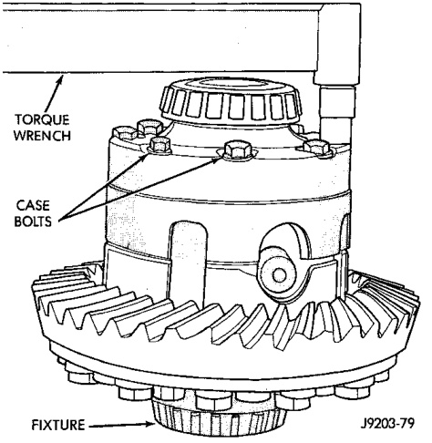
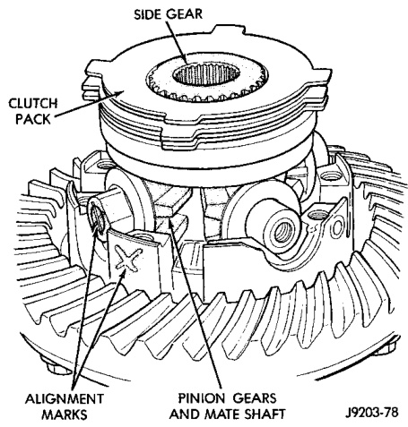
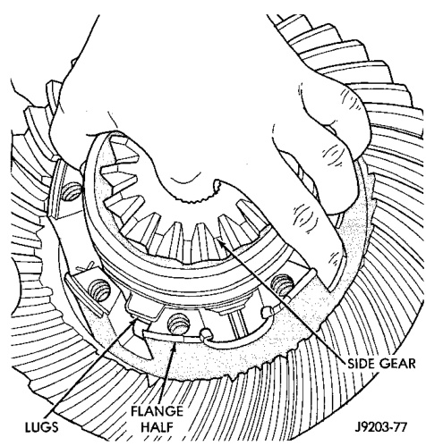

# DIFFERENTIAL AND DRIVELINE 3-144

## DISASSEMBLY AND ASSEMBLY (Continued)

*Fig. 44 Clutch Pack Installation*
- Side Gear
- Flange Half
- Lugs
- Clutch Pack

*Fig. 45 Clutch Pack Installation*
- Side Gear
- Alignment Marks
- Pinion Gears and Mate Shaft

*Fig. 43 Case Half Installation*
- Torque Wrench
- Case Bolts
- Fixture

---

## CLEANING AND INSPECTION

### AXLE COMPONENTS

Wash differential components with cleaning solvent and dry with compressed air. Do not steam clean the differential components.

Wash bearings with solvent and towel dry, or dry with compressed air. DO NOT spin bearings with compressed air. Cup and bearing must be replaced as matched sets only.

Clean axle shaft tubes and oil channels in housing. Inspect for:

- Smooth appearance with no broken/dented surfaces on the bearing rollers or the roller contact surfaces.
- Bearing cups must not be distorted or cracked.
- Machined surfaces should be smooth and without any raised edges.
- Raised metal on shoulders of cup bores should be removed with a hand stone.
- Wear and damage to pinion gear mate shaft, pinion gears, side gears and thrust washers. Replace as a matched set only.
- Ring and pinion gear for worn and chipped teeth.
- Ring gear for damaged bolt threads. Replaced as a matched set only.
- Pinion yoke for cracks, worn splines, pitted areas, and a rough/corroded seal contact surface. Repair or replace as necessary.
- Preload shims for damage and distortion. Install new shims, if necessary.

### TRAC-LOK

Clean all components in cleaning solvent. Dry components with compressed air. Inspect clutch pack plates for wear, scoring or damage. Replace both clutch packs if any one component in either pack is damaged. Inspect side and pinion gears. Replace any gear that is worn, cracked, chipped or damaged. Inspect differential case and pinion shaft. Replace if worn or damaged.
