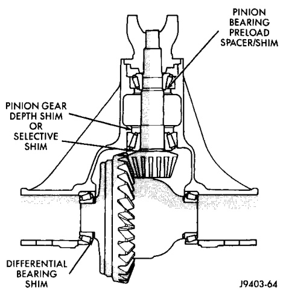
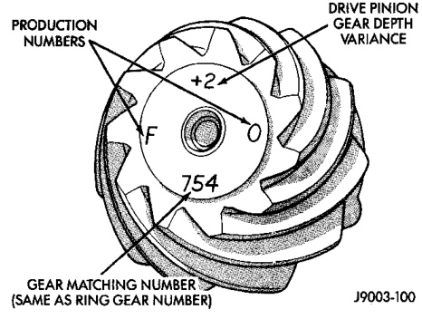

# DIFFERENTIAL AND DRIVELINE 3-145

## CLEANING AND INSPECTION (Continued)

### PRESOAK PLATES AND DISC

Plates and discs with fiber coating (no grooves or lines) must be presoaked in Friction Modifier before assembly. Soak plates and discs for a minimum of 20 minutes.

---

## ADJUSTMENTS

### PINION GEAR DEPTH

#### GENERAL INFORMATION

Ring and pinion gears are supplied as matched sets only. The identifying numbers for the ring and pinion gear are etched into the face of each gear (Fig. 46). A plus (+) number, minus (-) number or zero (0) is etched into the face of the pinion gear. This number is the amount (in thousandths of an inch) the depth varies from the standard depth setting of a pinion etched with a (0). The standard setting from the center line of the ring gear to the back face of the pinion is 147.625 mm (5.812 in.). The standard depth provides the best teeth contact pattern. Refer to Backlash and Contact Pattern Analysis Paragraph in this section for additional information.

*Fig. 46 Pinion Gear ID Numbers*
- Production Numbers
- Gear Matching Number (Same as Ring Gear Number)
- Drive Pinion Gear Depth Variance

Compensation for pinion depth variance is achieved with select shims. The shims are placed under the inner pinion bearing cone (Fig. 47).

If a new gear set is being installed, note the depth variance etched into both the original and replacement pinion gear. Add or subtract the thickness of the original depth shims to compensate for the difference in the depth variances. Refer to the Depth Variance charts.

Note where Old and New Pinion Marking columns intersect. Intersecting figure represents plus or minus amount needed.

Note the etched number on the face of the drive pinion gear (-1, -2, 0, +1, +2, etc.). The numbers represent thousands of an inch deviation from the standard. If the number is negative, add that value to the required thickness of the depth shim(s). If the number is positive, subtract that value from the thickness of the depth shim(s). If the number is 0 no change is necessary. Refer to the Pinion Gear Depth Variance Chart.

*Fig. 47 Shim Locations*
- Pinion Bearing Preload Spacer/Shim
- Pinion Gear Depth Shim or Selective Shim
- Differential Bearing Shim

#### PINION DEPTH MEASUREMENT AND ADJUSTMENT

Measurements are taken with pinion cups and pinion bearings installed in housing. Take measurements with a Pinion Gauge Set 6730 and Dial Indicator C-3339 (Fig. 48).

(1) Assemble Pinion Height Block 6739, Pinion Block 6738, and rear pinion bearing onto Screw 6741 (Fig. 48).

(2) Insert assembled height gauge components, rear bearing and screw into axle housing through pinion bearing cups (Fig. 49).

(3) Install front pinion bearing and Cone 6740 hand tight (Fig. 48).

(4) Place Arbor Disc 6732 on Arbor D-115-3 in position in axle housing side bearing cradles (Fig. 50). Install differential bearing caps on Arbor Discs and tighten cap bolts. Refer to the Torque Specifications in this section.

> **NOTE:** Arbor Discs 6732 have different step diameters to fit other axle sizes. Pick correct size step for axle being serviced.
