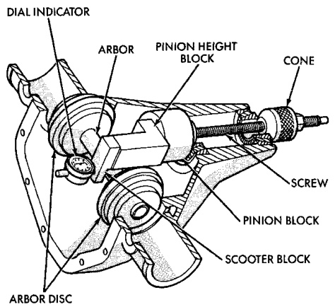
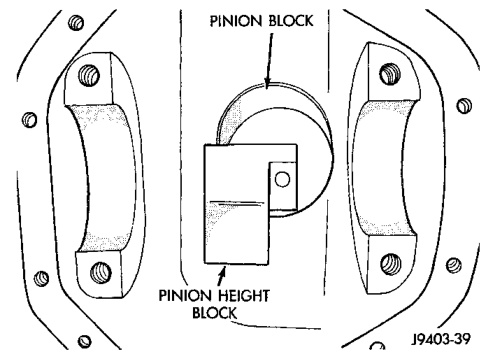

# DIFFERENTIAL AND DRIVELINE 3-146

## ADJUSTMENTS (Continued)

### PINION GEAR DEPTH VARIANCE

| Original Pinion Gear Depth Variance | Replacement Pinion Gear Depth Variance ||||||||
|---|---|---|---|---|---|---|---|---|
| | **-4** | **-3** | **-2** | **-1** | **0** | **+1** | **+2** | **+3** | **+4** |
| **+4** | +0.008 | +0.007 | +0.006 | +0.005 | +0.004 | +0.003 | +0.002 | +0.001 | 0 |
| **+3** | +0.007 | +0.006 | +0.005 | +0.004 | +0.003 | +0.002 | +0.001 | 0 | -0.001 |
| **+2** | +0.006 | +0.005 | +0.004 | +0.003 | +0.002 | +0.001 | 0 | -0.001 | -0.002 |
| **+1** | +0.005 | +0.004 | +0.003 | +0.002 | +0.001 | 0 | -0.001 | -0.002 | -0.003 |
| **0** | +0.004 | +0.003 | +0.002 | +0.001 | 0 | -0.001 | -0.002 | -0.003 | -0.004 |
| **-1** | +0.003 | +0.002 | +0.001 | 0 | -0.001 | -0.002 | -0.003 | -0.004 | -0.005 |
| **-2** | +0.002 | +0.001 | 0 | -0.001 | -0.002 | -0.003 | -0.004 | -0.005 | -0.006 |
| **-3** | +0.001 | 0 | -0.001 | -0.002 | -0.003 | -0.004 | -0.005 | -0.006 | -0.007 |
| **-4** | 0 | -0.001 | -0.002 | -0.003 | -0.004 | -0.005 | -0.006 | -0.007 | -0.008 |

*Fig. 49 Pinion Gear Depth Gauge Tools—Typical*
- Dial Indicator
- Arbor Disc
- Arbor
- Pinion Height Block
- Cone
- Pinion Block
- Scooter Block

(5) Assemble Dial Indicator C-3339 into Scooter Block D-115-2 and secure set screw.

(6) Place Scooter Block/Dial Indicator in position in axle housing so dial probe and scooter block are flush against the surface of the pinion height block. Hold scooter block in place and zero the dial indicator face to the pointer. Tighten dial indicator face lock screw.

*Fig. 51 Pinion Height Block—Typical*

(7) With scooter block still in position against the pinion height block, slowly slide the dial indicator probe over the edge of the pinion height block. Observe how many revolutions counterclockwise the dial pointer travels (approximately 0.125 in.) to the out-stop of the dial indicator.

(8) Slide the dial indicator probe across the gap between the pinion height block and the arbor bar with the scooter block against the pinion height block (Fig. 51). When the dial probe contacts the arbor bar, the dial pointer will turn clockwise. Bring dial pointer back to zero against the arbor bar, do not turn dial face. Continue moving the dial probe to the crest of the arbor bar and record the highest reading. If the dial indicator can not achieve the zero reading,
