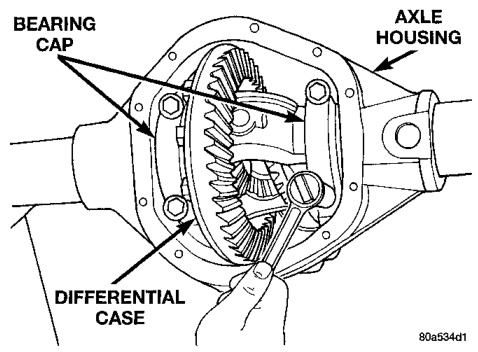
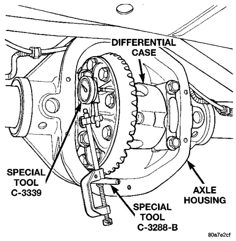
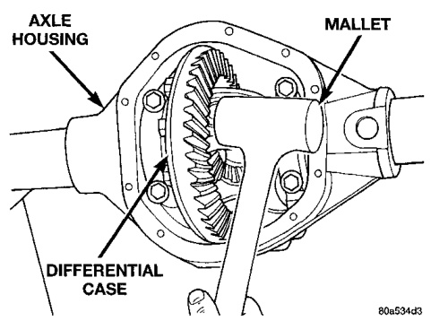
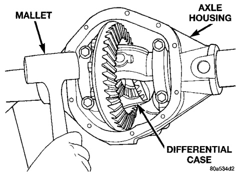

# DIFFERENTIAL AND DRIVELINE 3-148

## ADJUSTMENTS (Continued)

(6) Install the marked bearing caps in their correct positions. Install and snug the bolts (Fig. 53).

*Fig. 54 Tighten Bolts Holding Bearing Caps*
- Bearing Cap
- Axle Housing
- Differential Case

(7) Using a dead-blow type mallet, seat the differential dummy bearings to each side of the axle housing (Fig. 54) and (Fig. 55).

*Fig. 55 Seat Pinion Gear Side Differential Dummy Side Bearing*
- Mallet
- Axle Housing
- Differential Case

*Fig. 53 Seat Ring Gear Side Differential Dummy Side Bearing*
- Axle Housing
- Mallet
- Differential Case

(8) Thread guide stud C-3288-B into rear cover bolt hole below ring gear (Fig. 56).

(9) Attach a dial indicator C-3339 to guide stud. Position the dial indicator plunger on a flat surface between the ring gear bolt heads (Fig. 56).

*Fig. 56 Differential Side play Measurement*
- Differential Case
- Special Tool C-3339
- Special Tool C-3288-B
- Axle Housing

(10) Push and hold differential case to pinion gear side of axle housing (Fig. 57).

(11) Zero dial indicator face to pointer (Fig. 57).

(12) Push and hold differential case to ring gear side of the axle housing (Fig. 58).

(13) Record dial indicator reading (Fig. 58).

(14) Add 0.010 in. (0.254 mm) to the zero end play total. This new total represents the thickness of shims to compress, or preload the new bearings when the differential is installed.

(15) Rotate dial indicator out of the way on the guide stud.

(16) Remove differential case and dummy bearings from axle housing.

(17) Install the pinion gear in axle housing. Install the pinion yoke, or flange, and establish the correct pinion rotating torque.

(18) Install differential case and dummy bearings D-346 in axle housing (without shims), install bearing caps and tighten bolts snug.

(19) Seat ring gear side dummy bearing (Fig. 54).

(20) Position the dial indicator plunger on a flat surface between the ring gear bolt heads. (Fig. 56).

(21) Push and hold differential case toward pinion gear (Fig. 59).
