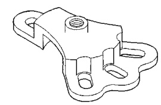
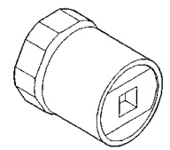
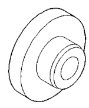
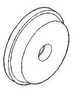

# DIFFERENTIAL AND DRIVELINE 3-152

## SPECIFICATIONS

### 286 RBI AXLES

| DESCRIPTION | SPEC. |
|-------------|-------|
| Axle Type | Hypoid |
| Lubricant | Thermally Stable SAE 80W-90 |
| Lube Capacity | |
| 4x2 | 3.22 L (6.81 pts.) |
| 4x4 | 4.00 L (8.45 pts.) |
| Axle Ratio | 3.54, 4.10 |
| Ring Gear | |
| Diameter | 279.4 mm (11.00 in.) |
| Backlash | 0.13-0.23 mm (0.005-0.009 in.) |
| Pinion Std. Depth | 118.923 mm (4.682 in.) |
| Pinion Bearing Preload | |
| Original Bearing | 1-3 N·m (10-20 in. lbs.) |
| New Bearing | 3-5 N·m (25-35 in. lbs.) |

---

## TORQUE

| DESCRIPTION | TORQUE |
|-------------|--------|
| **DIFFERENTIAL** | |
| Plug, Fill Hole | 34 N·m (25 ft. lbs.) |
| Bolts, Cover | 41 N·m (30 ft. lbs.) |
| Bolts, Bearing Cap | 163 N·m (120 ft. lbs.) |
| Nut, Pinion | 597-678 N·m (440-500 ft. lbs.) |
| Bolt, Ring Gear | 272-325 N·m (200-240 ft. lbs.) |
| Bolt, Axle to Hub | 129 N·m (95 ft. lbs.) |
| RWAL/ABS Sensor Bolt | 24 N·m (18 ft. lbs.) |
| **TRAC-LOK CASE BOLT** | |
| Standard | 122-136 N·m (90-100 ft. lbs.) |
| Heavy Duty | 163-190 N·m (120-140 ft. lbs.) |
| Nut, Hub | 163-190 N·m (120-140 ft. lbs.) |

---

## SPECIAL TOOLS

### 286 RBI AXLES

*Fig. 1 Puller, Hub—6790*

*Fig. 2 Wrench—DD-1241-JD*

*Fig. 3 Installer—0064*

*Fig. 4 Installer, Bearing Cup—4152*
